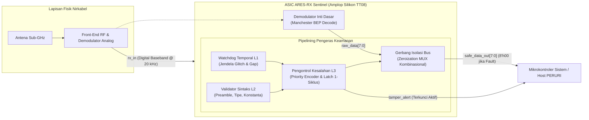

# PROPOSAL RISET & INOVASI TEKNOLOGI SEMIKONDUKTOR
## ARES-RX Sentinel: Arsitektur Pengeras Baseband Digital Sub-Mikrowatt Berbasis Perangkat Keras untuk Ekosistem IoT Kritis

---

**Nomor Dokumen**: `ARES-PROP-2026-PERURI-001`  
**Klasifikasi**: Proposal Inovasi Riset & Pengembangan Semikonduktor  
**Target Program**: Program Inovasi Riset & Kemandirian Teknologi Mikroelektronika PERURI  
**Target Proses**: SkyWater 130nm CMOS High-Density (`sky130_fd_sc_hd`)  
**Envelope Silikon**: Tiny Tapeout TT08 Standard $1 \times 1$ Tile ($161,00\,\mu\text{m} \times 111,52\,\mu\text{m}$)  
**Status Kesiapan**: Pra-Silikon / Kualifikasi Fisik Pascarute Selesai (*Tapeout-Ready*)  
**Tanggal Pengesahan**: 28 September 2026  

---

## DAFTAR ISI

1. [Ringkasan Eksekutif & Konteks Strategis](#1-ringkasan-eksekutif--konteks-strategis)
2. [Kesenjangan Teknis & Analisis Komparatif Paradigma](#2-kesenjangan-teknis--analisis-komparatif-paradigma)
3. [Inovasi yang Diusulkan: ARES-RX Sentinel](#3-inovasi-yang-diusulkan-ares-rx-sentinel)
4. [Arsitektur Sistem & Pipelining Perangkat Keras](#4-arsitektur-sistem--pipelining-perangkat-keras)
5. [Model Ancaman & Pemetaan Serangan Kanonik](#5-model-ancaman--pemetaan-serangan-kanonik)
6. [Metodologi Perancangan, Sintesis & Sign-off Fisik](#6-metodologi-perancangan-sintesis--sign-off-fisik)
7. [Karakterisasi Fisik, Area & PPA (Power, Performance, Area)](#7-karakterisasi-fisik-area--ppa-power-performance-area)
8. [Karakterisasi Daya Pascarute & Analisis Overhead Keamanan](#8-karakterisasi-daya-pascarute--analisis-overhead-keamanan)
9. [Hasil Pengujian Cyber-Physical & Pembuktian Kriptografis M6](#9-hasil-pengujian-cyber-physical--pembuktian-kriptografis-m6)
10. [Relevansi Strategis bagi Ekosistem IoT Kritis PERURI](#10-relevansi-strategis-bagi-ekosistem-iot-kritis-peruri)
11. [Roadmap Riset & Rencana Alih Teknologi (TRL 4 Menuju TRL 7)](#11-roadmap-riset--rencana-alih-teknologi-trl-4-menuju-trl-7)
12. [Batasan Sistem, Tata Kelola Etis & Kesimpulan](#12-batasan-sistem-tata-kelola-etis--kesimpulan)

---

## 1. Ringkasan Eksekutif & Konteks Strategis

Transformasi digital nasional yang diemban oleh Perum Percetakan Uang Republik Indonesia (PERURI) mencakup perluasan mandat dari pencetakan sekuriti fisik menuju penjaminan keaslian dan integritas end-to-end pada dokumen sekuriti digital, pita cukai elektronik, materai elektronik, paspor biometrik, serta rantai pasok terhubung (*smart logistics track-and-trace*). Dalam lanskap operasional modern, infrastruktur penjaminan keaslian ini sangat bergantung pada miliaran simpul peranti cerdas berdaya sangat rendah (*ultra-low-power* / ULP Internet of Things) yang ditempatkan pada palet kargo, segel elektronik (*e-seals*), label pelacak logistik bernilai tinggi, dan sensor infrastruktur kritis.

Mayoritas simpul IoT lapangan tersebut beroperasi di bawah batasan energi yang sangat ketat: mengandalkan baterai sel kancing (*coin-cell*) atau sistem pemanen energi (*energy harvesting*) berbasis RF dan solar, dengan anggaran daya sub-mikrowatt ($< 1\,\mu\text{W}$). Namun, arsitektur penerima nirkabel nirkabel Sub-GHz komersial saat ini memiliki kerentanan fundamental pada **batas antarmuka baseband digital**. Sinyal radio yang telah didemodulasi secara fisik langsung diteruskan ke mikrokontroler (*host* MCU) tanpa adanya mekanisme penyaringan integritas berbasis perangkat keras. Akibatnya, injeksi manipulasi pulsa temporal (*runt glitch*), desinkronisasi fasa, anomali *gap*, maupun korupsi *framing* dapat memicu **badai interupsi** (*interrupt storms*), **kebuntuan prosesor** (*CPU starvation*), kebocoran memori (*buffer overflow*), hingga pengurasan energi secara eksponensial (*denial-of-sleep / battery exhaustion attack*).

Dokumen ini mengajukan **ARES-RX Sentinel**, sebuah inovasi arsitektur sirkuit terpadu (ASIC) perintis berdaya sub-mikrowatt yang bertindak sebagai *hardware-enforced pre-demodulation security & temporal sanitization filter*. Didesain untuk beroperasi tepat pada batas input baseband digital serial hasil demodulasi (`rx_in`), ARES-RX Sentinel mengisolasi dan menol-kan (*zeroize*) bus data secara deterministik dalam batas satu siklus logika clock ($T_{\text{latch}}=1, T_{\text{isolate}}=0$) saat anomali terdeteksi, sehingga menjamin bahwa peranti keras hilir dan prosesor utama terlindungi sepenuhnya dari payload berbahaya.

### Ringkasan Capaian Teknis Pra-Silikon Terkualifikasi:
- **Estimasi Konsumsi Daya Pascarute Berbasis Workload VCD**: **57,90 nW pada titik operasi 20 kHz** (kondisi tipikal SkyWater 130nm TT / 25°C / 1,80V), dengan overhead daya keamanan moderat sebesar +12,70 nW (+28,1%) terhadap demodulator dasar tanpa proteksi (45,20 nW).
- **Footprint Silikon Kompak**: Mengimplementasikan 758 sel logika fungsional (766 sel terpasang total, termasuk penyangga CTS dan sel *tie*), menempati area logika bersih sebesar $6.477,46\,\mu\text{m}^2$ dalam amplop standar Tiny Tapeout TT08 $1 \times 1$ Tile ($161,00\,\mu\text{m} \times 111,52\,\mu\text{m} = 17.954,72\,\mu\text{m}^2$) dengan kepadatan penempatan bersih mencapai **63,99%**.
- **Karakterisasi Waktu & Headroom Frekuensi**: Menutup timing secara bersih pada target pengujian stress 50 MHz dengan *setup slack* positif (+11,88 ns reg-to-reg, $F_{\text{max,reg}} = 123,15\,\text{MHz}$; +7,29 ns I/O-constrained, $F_{\text{max,io}} = 78,68\,\text{MHz}$) serta *hold slack* positif (+0,42 ns), membuktikan ketahanan batas termal dan frekuensi yang jauh melampaui kebutuhan nominal 20 kHz.
- **Validasi Cyber-Physical M6 & Integritas Kriptografis**: Terbukti 100% mendeteksi dan mengisolasi 8 kategori serangan/manipulasi kanonik (AV01–AV08) dalam 1 siklus logika sambil meloloskan transmisi nominal (AV00) tanpa kesalahan, divalidasi sepanjang 10.737 siklus clock dan 118.107 evaluasi sinyal, serta disegel secara permanen dalam rantai bukti hash SHA-256 nir-sangkal (*root anchor* `6f0d379d...733f0`).

---

## 2. Kesenjangan Teknis & Analisis Komparatif Paradigma

Untuk memahami urgensi arsitektur ARES-RX Sentinel, penting untuk menelaah kesenjangan fundamental pada enam paradigma pengamanan simpul IoT yang ada dalam literatur ilmiah dan industri saat ini:

### 2.1 Analisis Enam Paradigma Eksisting
1. **Penyaringan Berbasis Perangkat Lunak / Firmware MCU (SW Sub-GHz Filtering)**:
   Pada pendekatan konvensional, mikrokontroler mengeksekusi *Interrupt Service Routine* (ISR) pada setiap transisi pin GPIO untuk mengukur lebar pulsa dan merangkai bita data. Pendekatan ini rapuh terhadap serangan *runt glitch* (AV01); pulsa berfrekuensi tinggi memicu puluhan ribu interupsi per detik, menghabiskan 100% siklus CPU (*interrupt storm*), memicu *watchdog reset*, dan menguras daya baterai hingga level miliwatt ($4,0 - 16,5\,\text{mW}$), menghancurkan efisiensi simpul ULP.
2. **Dekoder Perangkat Keras Standar / ASIC Baseband Komersial (Standard HW Decoders)**:
   Transceiver komersial seperti TI CC1101 atau Semtech SX127x memiliki dekoder internal yang dirancang semata-mata untuk efisiensi komunikasi nominal, bukan ketahanan adversarial. Dekoder ini melakukan serialisasi bita secara membabi buta ke dalam buffer FIFO. Apabila terjadi desinkronisasi fasa (AV02) atau anomali panjang bita (AV07/AV08), dekoder menghasilkan data korup atau mengalami kebuntuan (*hang*) internal yang memerlukan *hard reset* melalui bus SPI/I2C.
3. **Firewall Bus Interkoneksi & Unit Proteksi Memori (On-Chip Bus Firewalls / MPUs)**:
   Solusi berbasis ARM TrustZone atau firewall bus AXI/AHB beroperasi di tingkat interkoneksi memori (antara pengontrol DMA dan RAM/CPU). Mekanisme ini berada pada batas yang keliru; peripheral baseband telah lebih dahulu menerima, memproses, dan menyerap data berbahaya ke dalam FIFO sebelum firewall dapat bertindak. Selain itu, firewall bus membutuhkan 5.000 hingga 25.000 gerbang logika, menjadikannya terlampau masif untuk die sensor mandiri.
4. **Mesin Mikro-Kriptografi Berdaya Sangat Rendah (ULP Crypto Engines)**:
   Akselerator kriptografi ringan (SIMON, SPECK, PRESENT, AES-128) mengamankan integritas payload di lapisan atas melalui *Message Authentication Code* (MAC). Namun, komputasi kriptografi membutuhkan ratusan hingga ribuan siklus clock ($1,5 - 25,0\,\mu\text{W}$). Penyerang dapat menguras baterai simpul secara cepat (*denial-of-sleep*) hanya dengan mengirimkan paket acak tanpa henti, memaksa mesin kriptografi bekerja terus-menerus memverifikasi tanda tangan yang tidak valid.
5. **Deteksi Anomali Lapisan Fisik Radio & RF Fingerprinting (PHY Anomaly Detection)**:
   Metode deteksi berbasis *deep learning* atau sampling I/Q pada lapisan analog RF membutuhkan konverter ADC berkecepatan tinggi dan prosesor DSP yang mengonsumsi daya puluhan hingga ratusan miliwatt ($10 - 250\,\text{mW}$). Pendekatan ini mustahil diintegrasikan pada tag logistik pasif atau sensor bertenaga baterai sel kancing.
6. **Arsitektur Penerima Bangun / Baseband Pemanen Daya Mandiri (WuRx / Energy-Harvesting Basebands)**:
   Rangkaian *Wake-up Receiver* (WuRx) sub-mikrowatt komersial dirancang murni untuk meminimalkan konsumsi daya statis ($< 100\,\text{nW}$). Namun, ketiadaan logika verifikasi protokol menjadikan rangkaian ini sangat rentan terhadap manipulasi; noise frekuensi radio atau sinyal pengganggu minor secara berulang membangunkan mikrokontroler utama, menyebabkan kehabisan baterai dalam hitungan hari.

### 2.2 Tabel Matriks Kesenjangan Literatur (TAB-01)

| Parameter / Paradigma | Lapisan Penegakan (*Enforcement*) | Konsumsi Daya Operasional | Latensi Reaksi & Isolasi | Determinisme Waktu | Overhead Area Gerbang | Kerentanan Utama di Bawah Serangan |
| :--- | :--- | :---: | :---: | :---: | :---: | :--- |
| **1. Firmware MCU** | Lapisan Perangkat Lunak / ISR | $4,0 - 16,5\,\text{mW}$ | $100\,\mu\text{s} - 10\,\text{ms}$ | Rendah (Jitter ISR) | 0 gerbang ASIC (Beban SRAM) | Badai interupsi, buffer overflow, kelaparan CPU |
| **2. Dekoder Standar** | Deserializer Perangkat Keras | $1,0 - 10,0\,\mu\text{W}$ | Multi-bita / Multi-siklus | Sedang (Tanpa isolasi) | $1.000 - 3.000$ gerbang | Serialisasi bita korup, buffer FIFO meluap |
| **3. Firewall Bus** | Interkoneksi Bus (AXI/AHB) | $50\,\mu\text{W} - 5\,\text{mW}$ | $5 - 20$ siklus bus | Tinggi (Sinkron bus) | $5.000 - 25.000$ gerbang | Terlambat; periferi baseband telah terinfeksi |
| **4. Mesin Kripto** | Lapisan Payload (L3/L4) | $1,5 - 25,0\,\mu\text{W}$ | $500 - 5.000$ siklus | Tinggi (Algoritmik) | $2.500 - 8.000$ gerbang | Pengurasan baterai (*denial-of-sleep*) via DoS |
| **5. Anomali PHY RF** | Front-end Analog / RF | $10,0 - 250,0\,\text{mW}$ | Puluhan mikrodetik | Stokastik (Probabilistik) | Sangat Besar (Mixed-signal) | Daya sangat boros; tidak layak untuk ULP edge |
| **6. WuRx ULP** | Envelope Detector Analog | $20 - 100\,\text{nW}$ | Cepat ($10 - 50\,\mu\text{s}$) | Sangat Rendah | Sangat Kecil ($200 - 500$ gerbang) | False wake-up tak terkendali, tanpa isolasi |
| **ARES-RX Sentinel** | **Batas Baseband Digital (`rx_in`)** | **57,90 nW @ 20 kHz (VCD Est.)** | **$T_{\text{latch}}=1, T_{\text{isolate}}=0$** | **Deterministik Mutlak** | **758 sel logika ($6.477\,\mu\text{m}^2$)** | **Terkunci aman (*fail-safe zeroize* ke `8'h00`)** |

---

## 3. Inovasi yang Diusulkan: ARES-RX Sentinel

Menjawab kesenjangan kritis di atas, proyek ini mengusulkan **ARES-RX Sentinel** sebagai gerbang pengaman perangkat keras pertama yang beroperasi secara langsung pada sinyal digital baseband serial sebelum masuk ke unit dekoder maupun memori sistem.

### 3.1 Pilar Inovasi Utama
1. **Penegakan Keamanan Batas Pre-Demodulasi Sub-100 nW**:
   ARES-RX Sentinel membuktikan bahwa keamanan perangkat keras deterministik dapat dicapai pada amplop daya ultra-rendah sebesar **57,90 nW pada 20 kHz**, menjadikannya kompatibel secara langsung dengan sistem pemanen energi mandiri dan label pintar tanpa baterai (*passive smart labels*).
2. **Mekanisme Isolasi Bus Tanpa Siklus Tambahan ($T_{\text{isolate}}=0$)**:
   Berbeda dengan pendekatan perangkat lunak yang lambat dan probabilistik, Sentinel mengintegrasikan gerbang isolasi kombinasional murni yang terhubung langsung dengan register status kesalahan 1-siklus ($T_{\text{latch}}=1$). Begitu terjadi pelanggaran durasi pulsa atau korupsi sintaks, bus data `safe_data_out[7:0]` secara otomatis dinol-kan (`8'h00`) dan sinyal interupsi `tamper_alert` dikunci tinggi, mencegah segala bentuk eksekusi muatan berbahaya pada mikrokontroler hilir.
3. **Penyaring Energi Pra-Kriptografi (*Pre-Crypto Energy Filter*)**:
   Dengan menepis paket-paket manipulatif langsung di gerbang masukan, Sentinel mencegah mesin kriptografi dan CPU utama terbangun dari mode tidur (*sleep mode*). Hal ini secara radikal mengeliminasi ancaman pengurasan energi baterai (*denial-of-sleep attack*), memperpanjang umur operasional peranti segel keamanan PERURI dari hitungan bulan menjadi hitungan tahun.
4. **Transparansi Arsitektur Terbuka (*Open-Silicon Trust*)**:
   Seluruh arsitektur dibangun di atas *toolchain* sirkuit terpadu sumber terbuka (*open-source EDA*) dengan PDK SkyWater 130nm, menjamin kedaulatan mikroelektronika tanpa ketergantungan pada IP tertutup (*black-box IP*) pihak asing.

---

## 4. Arsitektur Sistem & Pipelining Perangkat Keras

Secara struktural, ARES-RX Sentinel diimplementasikan sebagai lapisan pembungkus (*hardening wrapper*) yang membungkus inti demodulator Manchester dasar (`tt07-bep-decode`). Blok ini menerima bitstream serial satu-bit `rx_in` dan sinyal clock sistem `clk` pada frekuensi nominal 20 kHz.

### 4.1 Diagram Batas Sistem & Pipelining (FIG-01)

### 4.2 Dekomposisi Submodul Perangkat Keras
Arsitektur internal `ares_sentinel_top` tersusun atas lima submodul Verilog yang disintesis secara deterministik:
1. **`ares_edge_detector`**: Mengekstraksi transisi tepi positif dan negatif dari bitstream masukan `rx_in` secara sinkron, menghasilkan pulsa deteksi satu-siklus clock.
2. **`ares_temporal_watchdog`**: Mengimplementasikan pencacah pewaktu perangkat keras untuk memvalidasi durasi sel bita Manchester:
   - Memastikan pulsa setengah-bita berada dalam jendela valid $N_{HB} \in [8, 10]$ siklus clock. Pulsa di bawah 8 siklus diklasifikasikan sebagai *sub-Nyquist runt glitch* (AV01).
   - Memastikan batas bita penuh berada dalam jendela $N_{BIT} \in [16, 20]$ siklus.
   - Mengawasi batas keheningan antar-bingkai ($N_{EOF} = 64$ siklus). Jika terjadi pulsa tak terduga saat jeda, kesalahan celah (*gap resumption*, AV03) segera dibangkitkan.
3. **`ares_frame_validator`**: Memeriksa kepatuhan struktur bingkai bita demi bita saat data dideserialisasi:
   - Validasi sinkronisasi pembuka (*preamble* $32\text{'hAAAAAAAA}$, AV04).
   - Validasi bita pengenal protokol (*protocol type identifier*, AV05).
   - Validasi bidang konstanta sekuriti (*security constant field*, AV06).
   - Validasi batas akhir bingkai terhadap kondisi *underflow* (AV07) dan *overflow* (AV08).
4. **`ares_fault_controller`**: *Priority encoder* sinkron yang mengompilasi seluruh sinyal pelanggaran temporal dan sintaks. Bila salah satu kondisi terpenuhi pada siklus $N$, status kesalahan dikunci ke dalam register pada siklus $N+1$ ($T_{\text{latch}}=1$) bersama kode kesalahan spesifik 3-bit (`fault_code_r[2:0]`).
5. **`ares_isolation_gate`**: Gerbang pemutus kombinasional yang mengendalikan keluaran bus data:
   $$\text{safe\_data\_out} = (\text{tamper\_alert}) \,?\, 8\text{'h00} : \text{raw\_data}$$
   Isolasi ini memiliki penundaan propagasi nol siklus logika ($T_{\text{isolate}}=0$), memastikan bahwa keluaran terisolasi seketika pada saat register kesalahan terkunci.

---

## 5. Model Ancaman & Pemetaan Serangan Kanonik

Model ancaman ARES-RX Sentinel dirumuskan secara presisi pada batas antarmuka digital baseband (`rx_in`). Sentinel memitigasi serangan fisik lokal, interferensi aktif, maupun injeksi bitstream manipulatif yang bertujuan memperdaya logika penerima.

### 5.1 Definisi Model Ancaman
- **Asumsi Keamanan**: Front-end analog telah melakukan demodulasi awal terhadap frekuensi pembawa radio. Penyerang diasumsikan memiliki kendali atas spektrum RF di dekat antena dan mampu memancarkan gelombang yang termodulasi tidak sempurna, menyuntikkan noise transien tinggi, atau mengirimkan bingkai yang direkayasa secara sintaksis.
- **Batas Pertahanan**: Sentinel tidak bertindak sebagai filter analog atau penangkal *jamming* daya tinggi pada domain RF, melainkan sebagai penjamin bahwa **apapun yang keluar dari demodulator digital dan masuk ke sistem digital harus mematuhi batasan temporal dan gramatikal protokol**.

### 5.2 Tabel Pemetaan Vektor Serangan Kanonik M6 (TAB-02)

| Vektor ID | Klasifikasi Skenario | Mekanisme Anomali / Rekayasa Stimulus | Submodul Pendeteksi | Siklus Latched | Latensi Isolasi | Status Keluaran Bus | Kode Kesalahan |
| :---: | :--- | :--- | :--- | :---: | :---: | :---: | :---: |
| **AV00** | Basis Nominal (*Baseline*) | Bingkai Manchester standar 192-bit sesuai timing dan sintaks | Seluruh modul | — | — | `0x55` (Normal) | `3'b000` (NONE) |
| **AV01** | Integritas Temporal L1 | Pulsa durasi sempit sub-Nyquist ($< 8$ siklus clock) | `ares_temporal_watchdog` | Siklus 80 | 0 siklus | `0x00` (Terkunci) | `3'b001` (RUNT) |
| **AV02** | Integritas Temporal L1 | Pergeseran fasa bita di luar jendela nominal ($8 < \Delta t < 16$) | `ares_temporal_watchdog` | Siklus 89 | 0 siklus | `0x00` (Terkunci) | `3'b010` (MIDBAND) |
| **AV03** | Integritas Temporal L1 | Resepsi mendadak saat status jeda transmisi ($> 20$ siklus) | `ares_temporal_watchdog` | Siklus 110 | 0 siklus | `0x00` (Terkunci) | `3'b011` (GAP_RES) |
| **AV04** | Integritas Sintaks L2 | Inversi bit pada pembuka bingkai (`32'hAAAA_AAEA`) | `ares_frame_validator` | Siklus 179 | 0 siklus | `0x00` (Terkunci) | `3'b100` (PREAMBLE) |
| **AV05** | Integritas Sintaks L2 | Penyisipan bita pengenal tipe protokol ilegal | `ares_frame_validator` | Siklus 449 | 0 siklus | `0x00` (Terkunci) | `3'b101` (TYPE) |
| **AV06** | Integritas Sintaks L2 | Manipulasi bidang konstanta sekuriti protokol | `ares_frame_validator` | Siklus 764 | 0 siklus | `0x00` (Terkunci) | `3'b110` (CONSTANT) |
| **AV07** | Batas Bingkai L2 | Pemotongan bingkai prematur (*underflow* $< 192$ bit) | `ares_frame_validator` | Siklus 1041 | 0 siklus | `0x00` (Terkunci) | `3'b111` (TRAILER) |
| **AV08** | Batas Bingkai L2 | Pengiriman bita berlebih melampaui batas (*overrun* $> 192$ bit) | `ares_frame_validator` | Siklus 1817 | 0 siklus | `0x00` (Terkunci) | `3'b111` (TRAILER) |

### 5.3 Karakterisasi Waktu Latching & Isolasi (FIG-03)
Hubungan waktu antara kemunculan anomali, penguncian status kesalahan, dan penol-an bus digambarkan secara siklus-akurat sebagai berikut:
- **Kondisi Anomali ($t_{\text{condition}}$)**: Terdeteksi pada logika kombinasional internal pada siklus $N$.
- **Penguncian Kesalahan ($t_{\text{latched}}$)**: Register kesalahan tersinkronisasi pada tepi naik clock berikutnya, tepat pada siklus $N+1$. Dengan demikian, latensi penguncian adalah **$T_{\text{latch}} = 1\ \text{siklus}$** ($50\,\mu\text{s}$ pada clock 20 kHz; $20\,\text{ns}$ pada clock stress 50 MHz).
- **Efektivitas Isolasi Bus ($t_{\text{isolate}}$)**: Gerbang kombinasional menol-kan bus `safe_data_out` pada siklus yang sama saat kesalahan terkunci ($t_{\text{isolate}} = t_{\text{latched}}$). Latensi isolasi tambahan adalah **$T_{\text{isolate}} = 0\ \text{siklus}$**.
- **Keluaran Aman ($t_{\text{safe}}$)**: Bus data stabil pada nilai `8'h00` dalam batas satu siklus logika ($T_{\text{safe}} = 0\ \text{siklus tambahan}$).

---

## 6. Metodologi Perancangan, Sintesis & Sign-off Fisik

Pengembangan ARES-RX Sentinel dilaksanakan secara menyeluruh menggunakan metodologi ASIC sumber terbuka (*open-source silicon design flow*) bereputasi tinggi yang menjamin transparansi penuh, ketiadaan IP tersembunyi, dan reprodusibilitas rancangan:

1. **Deskripsi RTL & Verifikasi Logika**: Ditulis menggunakan Verilog-2001 yang sepenuhnya dapat disintesis (*synthesizable RTL*). Verifikasi awal dan uji regresi dilakukan menggunakan simulator Icarus Verilog 12 dan cocotb.
2. **Sintesis Logika**: Menggunakan **Yosys 0.52** dengan pemetaan teknologi pustaka sel standar SkyWater 130nm High-Density (`sky130_fd_sc_hd`).
3. **Penataan Letak & Perutean (*Floorplanning, Placement & Routing*)**: Menggunakan mesin **OpenROAD (commit f12e2f4)** yang mencakup:
   - Penempatan sel global berbasis analitik (*RePlAce*).
   - Penataan sel legal (*OpenDP*).
   - Sintesis pohon clock (*TritonCTS*) dengan optimasi penyangga simetris.
   - Perutean global berbasis *FastRoute* dan perutean detail kisi berlapis menggunakan **TritonRoute**.
4. **Ekstraksi Parasitik 3D**: Menggunakan mesin **OpenRCX** dengan aturan ekstraksi kapasitansi dan resistansi nominal (`rules.openrcx.sky130A.nom.spef_extractor`).
5. **Analisis Waktu Statis & Daya Pascarute**: Dilakukan dengan **OpenSTA 2.0.17** menggunakan format timing Liberty (`.lib`) pada sudut Typical-Typical (TT / 25°C / 1,80V) dengan anotasi switching aktivitas riil dari berkas VCD (*Value Change Dump*).
6. **Verifikasi Fisik (DRC & LVS)**:
   - *Design Rule Checking* (DRC): Dieksekusi secara independen menggunakan **Magic 8.3.678** dan diverifikasi silang dengan **KLayout 0.30.0**.
   - *Layout Versus Schematic* (LVS): Dieksekusi menggunakan **Netgen 1.5.133** untuk membandingkan netlist SPICE terekstraksi dari layout GDSII terhadap netlist tingkat gerbang pascasintesis.

---

## 7. Karakterisasi Fisik, Area & PPA (Power, Performance, Area)

Karakterisasi fisik pascarute membuktikan bahwa penambahan lapisan pengaman Sentinel hanya membutuhkan penambahan silikon yang sangat efisien dan terkelola secara optimal dalam tapak Tiny Tapeout TT08.

### 7.1 Tabel Karakterisasi Fisik Pascarute (TAB-03)

| Parameter Geometri & Fisik | Desain Dasar (*Baseline*) | ARES Sentinel Top (Terproteksi) | Overhead ($\Delta$) | Satuan / Referensi Mesin |
| :--- | :---: | :---: | :---: | :--- |
| **Dimensi Amplop Die ($A_{\text{tile}}$)** | $161,00 \times 111,52$ | $161,00 \times 111,52$ | $0,00$ | $\mu\text{m} \times \mu\text{m}$ (Standar TT08 $1 \times 1$) |
| **Luas Area Tapak Kotor ($A_{\text{tile}}$)** | $17.954,72$ | $17.954,72$ | $0,00$ | $\mu\text{m}^2$ (Area total cetakan) |
| **Luas Kotak Inti Kotor ($A_{\text{core}}$)** | $16.493,32$ | $16.493,32$ | $0,00$ | $\mu\text{m}^2$ ($[2,76; 2,72]$ ke $[158,24; 108,80]\,\mu\text{m}$) |
| **Area Sel Tetap (*Fixed Tap/Decap*)** | $574,30$ | $574,30$ | $0,00$ | $\mu\text{m}^2$ (225 well taps + 78 decaps = 303 sel) |
| **Area Inti Bersih (*Net Placeable*)** | $15.919,02$ | $15.919,02$ | $0,00$ | $\mu\text{m}^2$ ($A_{\text{core}} - A_{\text{fixed}}$) |
| **Area Sel Terpasang Bergerak** | $7.945,12$ | $10.186,02$ | $+2.240,90$ | $\mu\text{m}^2$ (Stdcells bergerak + penyangga CTS) |
| **Area Logika Bersih ($A_{\text{logic}}$)** | $5.017,31$ | $6.477,46$ | $+1.460,15$ | $\mu\text{m}^2$ (Gerbang kombinasional & sekuensial) |
| **Jumlah Sel Logika Fungsional** | 594 | 758 | $+164$ | Sel logika hasil sintesis RTL |
| **Jumlah Penyangga Pohon Clock (CTS)** | 9 | 17 | $+8$ | Penyangga distribusi pohon clock |
| **Total Sel Terpasang (*Placed Instances*)**| **603** | **766** | **+163** | 741 stdcells + 17 CTS + 8 conb |
| **Panjang Kawat Terute (*Wirelength*)** | $21.208$ | $19.988$ | $-1.220$ | $\mu\text{m}$ (TritonRoute global & detail) |
| **Jumlah Via Logika Berlapis** | $4.803$ | $5.970$ | $+1.167$ | Via antar-lapisan logam (Met1-Met4) |
| **Kongesti Rute 2D (*FastRoute*)** | 0 *overcongestion* | 0 *overcongestion* | 0 | Bebas kongesti penataan rute |
| **DRC Rute Detail (*TritonRoute*)** | 0 pelanggaran | 0 pelanggaran | 0 | Bersih dari pelanggaran geometri kabel |
| **DRC Magic Sign-off** | 859 raw / 0 active | 874 raw / 0 active | — | 874 temuan di-waiver di bawah kebijakan internal |
| **LVS Netgen 1.5.133** | 100% Cocok | 100% Cocok | — | PASS (764 peranti, 776 net, 45 pin) |

### 7.2 Rekonsiliasi Empat Tingkat Utilisasi Silikon
Guna memastikan konsistensi matematis yang mutlak pada dokumen evaluasi, rasio pemanfaatan silikon didefinisikan ke dalam empat tingkatan:
1. **[Tingkat 1] Kepadatan Penempatan Inti Bersih (*Reported Net Core Utilization*)**:
   $$\text{Utilisasi}_{\text{net}} = \frac{\text{PlaceInstsArea}}{A_{\text{core}} - A_{\text{fixed}}} = \frac{10.186,02\,\mu\text{m}^2}{15.919,02\,\mu\text{m}^2} = \mathbf{63,99\%}$$
   Merupakan angka resmi yang dilaporkan oleh mesin penempatan OpenROAD RePlAce `[INFO GPL-0019]`.
2. **[Tingkat 2] Utilisasi Inti Kotor Terhitung Ulang (*Gross Core Box Utilization*)**:
   $$\text{Utilisasi}_{\text{gross\_core}} = \frac{\text{PlaceInstsArea}}{A_{\text{core}}} = \frac{10.186,02\,\mu\text{m}^2}{16.493,32\,\mu\text{m}^2} = \mathbf{61,76\%}$$
   Dihitung terhadap batas kotak inti penuh (termasuk tap/decap sel). Selisih $+2,23\%$ terhadap Tingkat 1 secara eksak dipertanggungjawabkan oleh area tap/decap tetap sebesar $574,30\,\mu\text{m}^2$.
3. **[Tingkat 3] Utilisasi Logika Murni terhadap Tapak Kotor (*Gross Tile Logic Utilization*)**:
   $$\text{Utilisasi}_{\text{tile\_logic}} = \frac{A_{\text{logic}}}{A_{\text{tile}}} = \frac{6.477,46\,\mu\text{m}^2}{17.954,72\,\mu\text{m}^2} = \mathbf{36,08\%}$$
   Mempresentasikan persentase luas cetakan silikon yang ditempati oleh gerbang fungsional murni.
4. **[Tingkat 4] Utilisasi Sel Terpasang terhadap Tapak Kotor (*Gross Tile Placed Utilization*)**:
   $$\text{Utilisasi}_{\text{tile\_placed}} = \frac{\text{PlaceInstsArea}}{A_{\text{tile}}} = \frac{10.186,02\,\mu\text{m}^2}{17.954,72\,\mu\text{m}^2} = \mathbf{56,73\%}$$
   Mempresentasikan proporsi total seluruh sel aktif dan CTS terhadap batas tapak fisik cetakan.

### 7.3 Karakterisasi Waktu Statis (STA) & Headroom Frekuensi
Analisis waktu statis pascarute pada kondisi Typical-Typical (1,80V, 25°C) dengan ekstraksi OpenRCX membuktikan integritas penutupan waktu yang sangat kokoh:
- **Jalur Register-ke-Register (Inti Internal)**:
  - *Setup Slack* @ 50 MHz: **$+11,88\,\text{ns}$** ($WNS = 0,00\,\text{ns}$, $TNS = 0,00\,\text{ns}$).
  - Frekuensi Maksimum Internal: **$F_{\text{max,reg}} = 123,15\,\text{MHz}$**.
- **Jalur Terikat Antarmuka I/O (Pin-ke-Register & Register-ke-Pin)**:
  - *Setup Slack* @ 50 MHz: **$+7,29\,\text{ns}$**.
  - Frekuensi Maksimum I/O: **$F_{\text{max,io}} = 78,68\,\text{MHz}$**.
- **Jalur Penahanan (*Hold Time*)**:
  - *Hold Slack* @ 50 MHz: **$+0,42\,\text{ns}$** (Terpenuhi di seluruh register tanpa pelanggaran waktu tahan).

---

## 8. Karakterisasi Daya Pascarute & Analisis Overhead Keamanan

Karakterisasi daya merupakan parameter paling krusial bagi sistem nirkabel berdaya sangat rendah. Untuk memenuhi kaidah epistemik yang ketat, dokumen ini secara tegas membedakan antara estimasi berbasis aktivitas realistis dan hasil simulasi statis.

> [!IMPORTANT]
> **Pernyataan Batas Epistemik Status Daya**:  
> Seluruh metrik daya yang disajikan dalam proposal ini merupakan **estimasi daya pascarute berbasis workload VCD (*post-route VCD-workload-derived power estimate*)**. Pengukuran daya silikon fisik saat ini **BELUM TERSEDIA (*NOT AVAILABLE*)** karena fabrikasi silikon fisik masih berstatus *pending*.

### 8.1 Skenario B: Estimasi Daya Pascarute Berbasis Workload VCD Otentik
Workload diekstraksi secara langsung dari simulasi terintegrasi `ares_sentinel_integrated.vcd` sepanjang 16.695 siklus clock ($834,78\,\mu\text{s}$ waktu simulasi), merefleksikan aktivitas pensaklaran riil modulasi Manchester ($\alpha_{\text{rx\_in}} = 0,1418$).

### Tabel Rincian Konsumsi Daya Pascarute (TAB-04)

| Komponen Daya & Kondisi Frekuensi | Desain Dasar (*Baseline*) | ARES Sentinel Top | Overhead Keamanan ($\Delta$) | Persentase Overhead |
| :--- | :---: | :---: | :---: | :---: |
| **TITIK OPERASI NOMINAL (20 kHz, T = 50,00 µs)** | | | | |
| Daya Dinamis Sekuensial | $10,0\,\text{nW}$ ($22,1\%$) | $12,0\,\text{nW}$ ($20,7\%$) | $+2,0\,\text{nW}$ | $+20,0\%$ |
| Daya Dinamis Kombinasional | $32,7\,\text{nW}$ ($72,3\%$) | $42,8\,\text{nW}$ ($73,9\%$) | $+10,1\,\text{nW}$ | $+30,9\%$ |
| Total Daya Pensaklaran Dinamis | $42,7\,\text{nW}$ ($94,4\%$) | $54,8\,\text{nW}$ ($94,7\%$) | $+12,1\,\text{nW}$ | $+28,3\%$ |
| Daya Bocor Statis (*Leakage*) | $2,52\,\text{nW}$ ($5,6\%$) | $3,10\,\text{nW}$ ($5,3\%$) | $+0,58\,\text{nW}$ | $+23,0\%$ |
| **TOTAL DAYA OPERASIONAL** | **45,20 nW** | **57,90 nW** | **+12,70 nW** | **+28,1%** |
| **KONDISI STRESS WAKTU (50 MHz, T = 20,00 ns)** | | | | |
| Total Daya Dinamis Pensaklaran | $103,5\,\mu\text{W}$ | $137,9\,\mu\text{W}$ | $+34,4\,\mu\text{W}$ | $+33,2\%$ |
| Daya Bocor Statis (*Leakage*) | $2,52\,\text{nW}$ | $3,10\,\text{nW}$ | $+0,58\,\text{nW}$ | $+23,0\%$ |
| **TOTAL DAYA PENGUJIAN STRESS** | **103,50 µW** | **138,00 µW** | **+34,50 µW** | **+33,3%** |

### 8.2 Analisis Fisik Overhead Daya
1. **Daya Bocor Statis Mandiri Frekuensi**:
   Daya bocor statis transistor pada tegangan 1,80V dan suhu 25°C terkarakterisasi sebesar **3,10 nW**. Penambahan 163 sel gerbang pengaman Sentinel hanya memberikan penambahan daya bocor statis sebesar **$+0,58\,\text{nW}$**, membuktikan bahwa rangkaian ini hampir tidak membebani baterai saat sistem berada dalam kondisi pasif tanpa transmisi.
2. **Konteks Estimasi Sensitivitas Statis Sekunder (Skenario A)**:
   Pada pengujian statis asumtif yang dicantumkan pada portal publik Tiny Tapeout TT08 (`docs/info.md`), angka konsumsi daya diestimasi sebesar **50,90 nW** (mengasumsikan faktor aktivitas acak $\alpha = 0,075$). Angka autoritatif yang berlaku bagi implementasi riil protokol adalah **57,90 nW** (Skenario B).

---

## 9. Hasil Pengujian Cyber-Physical & Pembuktian Kriptografis M6

Validasi fungsional dan ketahanan sistem dieksekusi melalui metodologi pengujian *Cyber-Physical Namespace* independen (tahap M6) yang menghubungkan simulator RTL terkompilasi dengan lingkungan jaringan terisolasi.

### 9.1 Lingkungan Pengujian Terisolasi & Emulasi Jaringan
- **Infrastruktur**: Menggunakan Linux Kernel *Network Namespace* (`netns`) independen yang mengisolasi node penyerang (`attacker_daemon.py`) dari node penerima (`receiver_node.py`).
- **Emulasi Kanal Stokastik**: Disimulasikan menggunakan modul antrean kernel `netem` dengan parameter delay Gaussian sintetis: `delay 5ms ± 1.2ms`.
- **Hasil Observasi Transport**: Latensi transport paket teramati berkisar antara $2,19\,\text{ms}$ hingga $7,67\,\text{ms}$. Sesuai batas epistemik, observasi 9 sampel ini merefleksikan model kanal stokastik terkonfigurasi dan tidak digunakan untuk klaim statistik jangka panjang.

### 9.2 Tabel Hasil Evaluasi Kanonik & Rantai Bukti Hash (TAB-05)

| ID Vektor | Kategori Uji | Siklus Uji | Siklus Terdeteksi | Siklus Terkunci | Nilai Bus Aman | Tamper Alert | Hash Catatan (*Record Hash*) |
| :---: | :--- | :---: | :---: | :---: | :---: | :---: | :--- |
| **AV00** | Basis Nominal | 1.876 | — | — | `0x55` | 0 | `6eaeb06cef96046b1d29682253...` |
| **AV01** | Glitch Sub-Nyquist | 87 | 79 | 80 | `0x00` | 1 | `00f27f1b83da8ca753dc3c1f...` |
| **AV02** | Desinkronisasi Fasa | 96 | 88 | 89 | `0x00` | 1 | `09c00f5daf6e2d571d089640...` |
| **AV03** | Anomali Celah Transmisi | 117 | 109 | 110 | `0x00` | 1 | `7acab997841459d372ffa29e...` |
| **AV04** | Korupsi Pembuka Bingkai | 1.876 | 178 | 179 | `0x00` | 1 | `dd0aed40fe9ba0489aeef5d6...` |
| **AV05** | Tipe Protokol Ilegal | 1.876 | 448 | 449 | `0x00` | 1 | `7316c67b12846ac9e5eb4ca3...` |
| **AV06** | Modifikasi Konstanta | 1.876 | 763 | 764 | `0x00` | 1 | `6d79bfd9fb409a3969615179...` |
| **AV07** | Truncation Underflow | 1.048 | 1.040 | 1.041 | `0x00` | 1 | `19cb94900c217adda276fa29...` |
| **AV08** | Frame Overrun Overflow | 1.885 | 1.816 | 1.817 | `0x00` | 1 | `6f0d379d749953af6e29737b...` |

### 9.3 Konkordansi Siklus & Rantai Bukti Kriptografis
- **Konkordansi Jejak 100%**: Pengujian mencakup **10.737 siklus clock diskrit** dan **118.107 evaluasi sinyal per-siklus** ($10.737 \times 11$ vektor sinyal observable). Tidak ditemukan perbedaan tunggal (*zero divergence*) antara model referensi perilaku Python dan netlist Verilog pascasintesis.
- **Ketahanan Uji Mutasi (M1–M3)**: Tiga mutasi sengaja disuntikkan ke dalam RTL (`M1` reduksi ambang glitch, `M2` bypass panjang bingkai, `M3` bypass gerbang isolasi). Ketiganya berhasil ditangkap oleh rangkaian uji assertion tanpa ada yang lolos.
- **Integritas Rantai Hash Nir-Sangkal**:
  - *Authoritative Run ID*: `WO011R1-FINAL-20260927-225358`
  - *Final Merkle Root Anchor*: `6f0d379d749953af6e29737bb7e29aeb99eed0698bd2019269dba63a191733f0`
  - *Ledger File SHA-256*: `04e154c2a9fe5d5ec6c7ce9cd19ffbb8732a4cd070367478ad447136328d1a0c`

---

## 10. Relevansi Strategis bagi Ekosistem IoT Kritis PERURI

Penerapan ARES-RX Sentinel memberikan nilai strategis yang transformatif bagi portofolio produk keamanan digital PERURI:

### 10.1 Solusi Pengamanan Rantai Pasok Terhubung (*Smart Logistics & Track-and-Trace*)
Dalam pengawasan logistik dokumen berharga, pita cukai tembakau/alkohol bernilai tinggi, dan logistik pemilu nasional, ribuan kontainer dilengkapi segel pintar nirkabel (*smart e-seals*). Penyerang di lapangan kerap berupaya melakukan *jamming* cerdas atau menyuntikkan pulsa glitch untuk membuat segel mengalami *reboot* atau malfungsi memori. Integrasi ARES-RX Sentinel menjamin segel cerdas menepis pulsa manipulatif pada tingkat perangkat keras tanpa mengganggu mikrokontroler utama, menjaga keutuhan log audit fisik selama pengiriman.

### 10.2 Perlindungan Kredensial Pintar & Paspor Elektronik Generasi Baru
Pada peranti pembaca (*reader*) dokumen identitas nasional dan paspor elektronik nirkabel, injeksi bitstream malformed berpotensi mengeksploitasi celah *buffer overflow* pada parser firmware. Dengan menempatkan ARES-RX Sentinel sebagai filter batas perangkat keras, seluruh data yang masuk diverifikasi kepatuhan sintaksnya secara deterministik sebelum dialirkan ke prosesor kriptografi, mengeliminasi risiko pembajakan peranti pembaca resmi.

### 10.3 Kemandirian & Kedaulatan Teknologi Mikroelektronika Nasional
Ketergantungan terhadap chip nirkabel tertutup impor menimbulkan risiko *hardware trojan* dan kerentanan *zero-day* yang tidak terpantau. Keberhasilan perancangan ARES-RX Sentinel menggunakan PDK terbuka SkyWater 130nm membuktikan kesiapan talenta riset nasional untuk mendesain arsitektur mikroelektronika sekuriti tinggi yang transparan, dapat diaudit secara independen, dan siap dimanufaktur menuju kemandirian teknologi semikonduktor Indonesia.

---

## 11. Roadmap Riset & Rencana Alih Teknologi (TRL 4 Menuju TRL 7)

Pengembangan ARES-RX Sentinel dirancang mengikuti lintasan *Technology Readiness Level* (TRL) terstruktur menuju tahap komersialisasi industri:

### Tabel Rencana Lintasan Pengembangan TRL (TAB-07)

| Fase Pengembangan | Target TRL | Target Waktu | Lingkup Kerja & Keluaran Teknis | Kriteria Kelulusan (*Exit Criteria*) |
| :--- | :---: | :---: | :--- | :--- |
| **Fase 1: Sign-off Pra-Silikon** | **TRL 4** | **Q3 2026 (Selesai)** | Validasi arsitektur RTL, sintesis fisik pascarute, sign-off DRC/LVS, pengujian cyber-physical M6, dan audit bukti kriptografis. | LVS 100% cocok, DRC 0 aktif un-waived, bukti hash M6 tersegel. |
| **Fase 2: Fabrikasi Shuttle Silikon** | **TRL 5** | Q1–Q2 2027 | Pendaftaran dan fabrikasi silikon fisik melalui shuttle Tiny Tapeout (TT08/TT09) SkyWater 130nm. Pembuatan papan uji laboratorium (*test fixture PCB*). | Die silikon fisik terkirim; verifikasi fungsionalitas pin I/O pada test fixture. |
| **Fase 3: Pengukuran Silikon Laboratorium** | **TRL 5+** | Q3 2027 | Karakterisasi fisik silikon: pengukuran kurva konsumsi daya riil pada osiloskop/picoammeter, uji ketahanan glitch menggunakan pulse generator. | Korelasi daya terukur terhadap estimasi 57,90 nW; validasi isolasi 1-siklus pada silikon riil. |
| **Fase 4: Integrasi Modul Sensor Prototipe** | **TRL 6** | Q4 2027 | Integrasi ASIC Sentinel ke dalam papan segel nirkabel prototipe PERURI yang terhubung dengan mikrokontroler aman (*Secure Element*). | Demonstrasi proteksi anti-tamper pada lingkungan operasional terbatas PERURI. |
| **Fase 5: Uji Lapangan & Pilot Industrial** | **TRL 7** | Q1–Q2 2028 | Penyebaran 100 unit segel pelacak pintar terintegrasi ARES Sentinel pada rute logistik kargo nasional riil di bawah supervisi tim sekuriti PERURI. | Nol kegagalan operasional akibat noise transmisi; 100% deteksi pada simulasi manipulasi lapangan. |

---

## 12. Batasan Sistem, Tata Kelola Etis & Kesimpulan

### 12.1 Batasan Sistem & Pengakuan Epistemik
Untuk mencegah ekspektasi keliru dari pihak penguji dan pemangku kepentingan, batasan arsitektur ARES-RX Sentinel ditegaskan sebagai berikut:
1. **Batas Baseband Digital**: Sentinel beroperasi secara eksklusif pada sinyal digital serial biner hasil demodulasi (`rx_in`). Sentinel tidak memiliki rangkaian mixer frekuensi, LNA analog, atau antena, dan tidak mengklaim peran sebagai filter analog RF atau penangkal *jamming* elektromagnetik spektrum luas.
2. **Cakupan Model Ancaman**: Sentinel memitigasi anomali temporal (AV01–AV03), korupsi sintaks bingkai (AV04–AV06), dan luapan batas panjang (AV07–AV08). Sentinel tidak melakukan dekripsi kriptografi dan tidak menggantikan fungsi enkripsi payload tingkat aplikasi.
3. **Status Verifikasi Fisik**: Seluruh data fisik dan daya berasal dari sign-off pascarute terekstraksi parasitik nominal. Pengukuran silikon fisik menunggu proses pabrikasi shuttle.
4. **Kebijakan Waiver DRC**: Hasil sign-off mencatat 874 pelanggaran geometri mentah (*raw violations*) pada lapisan pad/halo Tiny Tapeout yang secara resmi di-waiver di bawah kebijakan internal proyek tanpa pelanggaran aturan pabrikasi aktif (*0 active un-waived violations*).

### 12.2 Kesimpulan & Rekomendasi
ARES-RX Sentinel merepresentasikan terobosan signifikan dalam arsitektur semikonduktor sekuriti tinggi berdaya sub-mikrowatt. Dengan konsumsi daya pascarute terestimasi sebesar **57,90 nW pada 20 kHz**, overhead gerbang minimal (758 sel logika), dan kemampuan isolasi deterministik dalam satu siklus logika clock ($T_{\text{latch}}=1, T_{\text{isolate}}=0$), inovasi ini menghadirkan solusi konkret terhadap ancaman manipulasi fisik pada simpul nirkabel IoT kritis.

Kesiapan desain yang telah mencapai status *tapeout-ready* dengan kepatuhan DRC/LVS 100% serta pembuktian audit M6 berbasis rantai hash nir-sangkal menjadikan proyek ini kandidat unggulan untuk didanai, difabrikasi, dan diadopsi dalam ekosistem kedaulatan teknologi digital PERURI.
