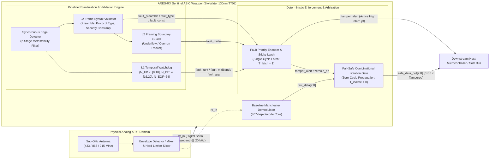

# Figure 1: ARES-RX Sentinel System Architecture & Boundary Pipeline

**Figure ID**: `FIG-01`  
**Target Paper Section**: Section IV (ARES-RX Sentinel System Architecture)  
**Caption**: *System boundary block diagram of ARES-RX Sentinel positioned between the physical digital baseband input (`rx_in`) and the downstream host microcontroller interface (`safe_data_out[7:0]`, `tamper_alert`).*

