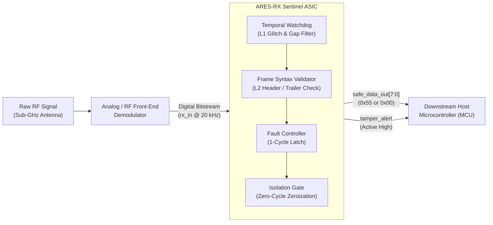

# Figure & Table Register (FTR) — ARES-RX Sentinel

**Document ID**: `ARES-RC-FTR-001`  
**Version**: `1.0.0-LOCKED`  
**Classification**: Visual Assets, Schematics, State Diagrams & Table Registry  
**Status**: **FROZEN / BINDING ON ALL DRAFTS**  

---

## 1. Overview & Formatting Guidelines

This register indexes all diagrams, state machines, architecture schematics, and comparative tables utilized across:
- **Proposal PERURI** (`01_Proposal/`)
- **Journal Manuscript** (`02_Journal/`)
- **Final Abstract** (`03_Abstract/`)

All diagrams are formatted using text/Mermaid or IEEE-standard tabular typography.

---

## 2. Master Diagram & Schematic Register

| Diagram ID | Target Section | Title / Description | Key Components / Nodes | Canonical Caption |
| :---: | :--- | :--- | :--- | :--- |
| **FIG-01** | Proposal Sec 4 / Journal Sec IV | **ARES-RX Sentinel System Architecture & Boundary Pipeline** | RF Demodulator $\rightarrow$ Digital Baseband Interface (`rx_in`) $\rightarrow$ Sentinel Pipeline (Temporal Watchdog, Frame Validator, Protocol FSM, Isolation Gate) $\rightarrow$ Downstream Host Bus (`safe_data_out[7:0]`, `tamper_alert`). | *System boundary block diagram of ARES-RX Sentinel positioned between the physical digital baseband input and the downstream host microcontroller interface.* |
| **FIG-02** | Proposal Sec 4 / Journal Sec V | **Detailed Microarchitectural Submodule Decomposition** | `ares_sentinel_top`: 1. `ares_edge_detector` (pulse extraction), 2. `ares_temporal_watchdog` (counter windows $N_{HB}=8..10, N_{BIT}=16..20$), 3. `ares_frame_validator` (preamble, type, constant), 4. `ares_fault_controller` (fault priority encoder & latch), 5. `ares_isolation_gate` (zeroization MUX). | *Internal microarchitecture of the Sentinel hardening wrapper, illustrating pipelined detection stages and zero-overhead combinational bus zeroization.* |
| **FIG-03** | Proposal Sec 5 / Journal Sec III | **Threat Vector Ingress & Latching Timing Diagram** | Timeline showing $t_{\text{condition}}$, clock edge, $t_{\text{latched}} = t_{\text{condition}} + 1\ \text{cycle}$, and instantaneous bus clamping ($T_{\text{isolate}}=0$). | *Timing diagram of fault assertion showing synchronous single-cycle latching ($T_{\text{latch}}=1$) and combinational output isolation ($T_{\text{isolate}}=0$).* |
| **FIG-04** | Proposal Sec 6 / Journal Sec VI | **Cyber-Physical Namespace Verification Architecture** | Attacker Node (`attacker_daemon.py`), Virtual Stochastic Network Channel (`netem 5ms ± 1.2ms`), Receiver Node (`receiver_node.py`), Verilog Co-simulator, Tamper-Evident SHA-256 Ledger. | *Pre-silicon cyber-physical / RTL co-simulation verification pipeline across isolated Linux network namespaces with continuous cryptographic hash chaining.* |
| **FIG-05** | Proposal Sec 7 / Journal Sec VII | **Floorplan & Silicon Layout Decomposition (SkyWater 130nm TT08)** | TT08 $1 \times 1$ Tile ($161.00 \times 111.52\,\mu\text{m}$), Core Box ($155.48 \times 106.08\,\mu\text{m}$), Power Ring, Tap/Decap Rows, Placed Standard Cell Rows (63.99% net density). | *Physical layout and cell placement distribution of ARES-RX Sentinel within the Tiny Tapeout TT08 $1 \times 1$ silicon tile envelope.* |
| **FIG-06** | Journal Sec II | **Taxonomy of Sub-GHz IoT Receiver Security Approaches** | Literature tree categorizing 6 defense paradigms: SW Sub-GHz, HW Decoders, Bus Firewalls, Crypto micro-RX, PHY Anomaly, and Baseband Hardening (ARES). | *Structural classification of security enforcement layers across the ultra-low-power IoT wireless receiver stack.* |

---

## 3. Master Table Register

| Table ID | Target Section | Title | Primary Metrics / Content | Canonical Source |
| :---: | :--- | :--- | :--- | :--- |
| **TAB-01** | Proposal Sec 2 / Journal Sec II | **Literature Gap & Comparative Paradigm Matrix** | 6 categories across 6 axes: Operating Layer, Energy Footprint, Reaction Latency, Determinism, Area Overhead, Failure Modes. | `Literature_Gap_Matrix.md` |
| **TAB-02** | Proposal Sec 5 / Journal Sec III | **ARES Threat Model & Canonical Attack Mapping** | Vectors AV00–AV08 mapped to physical fault mechanism, protocol vulnerability, detection submodule, and latched fault code. | `Experiment_Register.md` |
| **TAB-03** | Proposal Sec 7 / Journal Sec VII | **Physical Implementation & PPA Sign-Off Scorecard** | Area decomposition, cell counts, placement density, wirelength, vias, setup/hold slacks, DRC/LVS verdicts. | `Metric_Authority_Register.md` (Sec 1-4, 6) |
| **TAB-04** | Proposal Sec 8 / Journal Sec VII | **Post-Route Power Breakdown & Overhead Characterization** | Dynamic sequential, combinational, static leakage, total power @ 20 kHz (Scenario B) and 50 MHz stress. | `Metric_Authority_Register.md` (Sec 5) |
| **TAB-05** | Proposal Sec 8 / Journal Sec VIII | **M6 Canonical Cyber-Physical Verification Results** | 9-vector results: cycles, fault condition cycle, latch cycle, isolation latency, safe bus output, cryptographic hash anchor. | `Experiment_Register.md` (Sec 2, 4) |
| **TAB-06** | Journal Sec VIII | **Hardware Mutation Testbench Benchmarks (M1–M3)** | Injected RTL mutants, submodules, bypass risks, detection testbench, trapping verdict. | `Experiment_Register.md` (Sec 3) |
| **TAB-07** | Proposal Sec 10 / Journal Sec IX | **R&D Roadmap & Technology Readiness Level (TRL) Trajectory** | Current TRL 4 (Pre-silicon lab sign-off) to TRL 5 (Shuttle fabrication) to TRL 7 (Peruri secure embedded silicon pilot). | Proposal Sec 10 |

---

## 4. Text/Mermaid Representations for Core Schematics

### 4.1 System Boundary Pipeline (FIG-01)


### 4.2 Threat Latching & Isolation Timing (FIG-03)
```text
Clock Cycle:      | N-1         | N (Condition) | N+1 (Latched) | N+2         |
clk:             _/‾\_/‾\_/‾\_/‾\_/‾\_/‾\_/‾\_/‾\_/‾\_/‾\_/‾\_/‾\_/‾\_/‾\_/‾\_
rx_in:           XXXXXXXXXXXXXXX [MALFORMED / RUNT EDGE] XXXXXXXXXXXXXXXXXXXXX
fault_detected:  _______________________/‾‾‾‾‾‾‾‾‾‾‾‾‾‾‾‾‾‾‾‾‾‾‾‾‾‾‾‾‾‾‾‾‾‾‾‾‾ (Internal comb)
fault_code_r:    [  3'b000 (NONE)      ]--------[ 3'b001..111 (FAULT)        ] (T_latch = 1)
tamper_alert:    _______________________________/‾‾‾‾‾‾‾‾‾‾‾‾‾‾‾‾‾‾‾‾‾‾‾‾‾‾‾‾‾ (T_latch = 1)
safe_data_out:   [  0x55 (Nominal)     ]--------[ 0x00 (ZEROIZED)             ] (T_isolate = 0)
```
