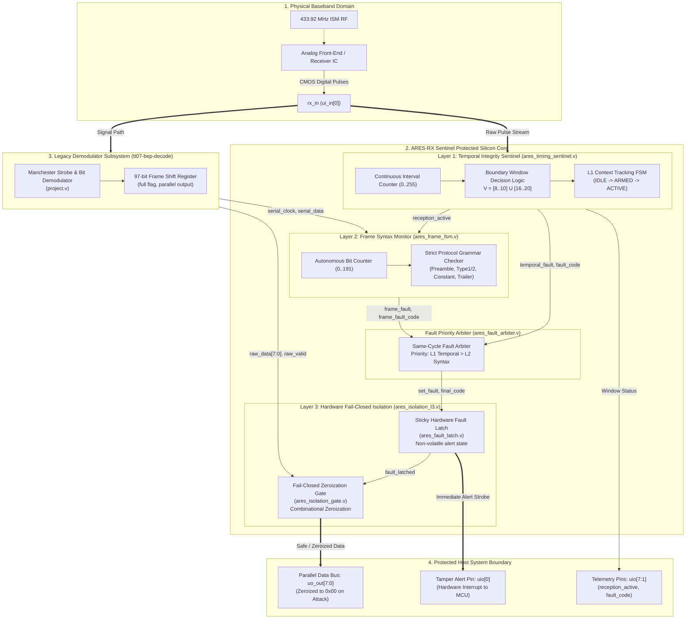

# ARES-RX Sentinel — 3-Layer Security Architecture
## Document: `06_Demonstration/ARES-RX_Sentinel/figures/01_security_architecture.md`
**Target Silicon:** SkyWater 130nm TT08 1x1 Tile ($161.00\,\mu\text{m} \times 111.52\,\mu\text{m}$)  
**Classification:** Academic & Competition Technical Figure  

---

## 1. Architectural System Overview

ARES-RX Sentinel operates as a **Trusted Digital Reception Boundary** inserted between an external CMOS digital receiver baseband (`rx_in`) and the legacy baseline demodulator (`tt07-bep-decode`). It guarantees that no corrupted, injected, or desynchronized payload reaches the host microcontroller.



---

## 2. Formal Layered Demarcation

| Architectural Layer | Verilog Module | Function & Security Guarantee | Physical Latency |
| :--- | :--- | :--- | :---: |
| **Layer 1: Temporal Integrity** | `ares_timing_sentinel.v` | Enforces discrete pulse duration bounds $\mathcal{V} = [8..10] \cup [16..20]$ clock cycles ($400..500\,\mu\text{s}$ and $800..1000\,\mu\text{s}$). Rejects glitches, runt pulses, and mid-band jitter. | 1 Clock Cycle ($50\,\mu\text{s}$) |
| **Layer 2: Syntax Integrity** | `ares_frame_fsm.v` | Autonomous 0–191 bit counter validating immutable protocol fields: Preamble (`32'hAAAAAAAA`), Type 1/2 (`16'hD391`), Constant (`32'h0DFFFFFE`). Transparent to dynamic telemetry. Rejects truncation & overrun. | 1 Clock Cycle ($50\,\mu\text{s}$) |
| **Priority Arbiter** | `ares_fault_arbiter.v` | Resolves simultaneous same-cycle temporal and syntactic faults with absolute deterministic precedence: $L1 > L2$. | 0 Clock Cycles (Combinational) |
| **Layer 3: Isolation Latch** | `ares_fault_latch.v` | Sticky sequential memory latch capturing the primary root cause. Locks until system hardware reset (`rst_n`). | 1 Clock Cycle ($50\,\mu\text{s}$) |
| **Layer 3: Zeroization Gate** | `ares_isolation_gate.v` | Pure combinational gate clamping host data bus to `8'h00` upon fault assertion. Zero leakage of malicious payloads. | 0 Clock Cycles ($< 1\,\text{ns}$ gate delay) |

---

## 3. Threat Model Coverage

```text
+-----------------------+-----------------------------+-----------------------------+
| Threat Category       | Unprotected Baseline        | ARES-RX Sentinel Protected  |
+-----------------------+-----------------------------+-----------------------------+
| Runt Glitch (N <= 7)  | Silent desync / buffer hang | L1 Trap -> Tamper Alert -> Zeroization |
| Mid-Band Noise (11-15)| Manchester strobe drift     | L1 Trap -> Tamper Alert -> Zeroization |
| Missing Edge (N >= 21)| Timeout deadlock            | L1 Gap Timeout -> Reset to Armed |
| Preamble Spoofing     | Corrupt frame accepted      | L2 Trap -> Tamper Alert -> Zeroization |
| Type/Constant Tamper  | Actuator state corruption   | L2 Trap -> Tamper Alert -> Zeroization |
| Frame Truncation      | Incomplete buffer read      | L2 Trap -> Silence without 192b trapped |
| Frame Overrun (> 192b)| Buffer overflow / bleed     | L2 Trap -> Overrun bit trapped immediately |
+-----------------------+-----------------------------+-----------------------------+
```
