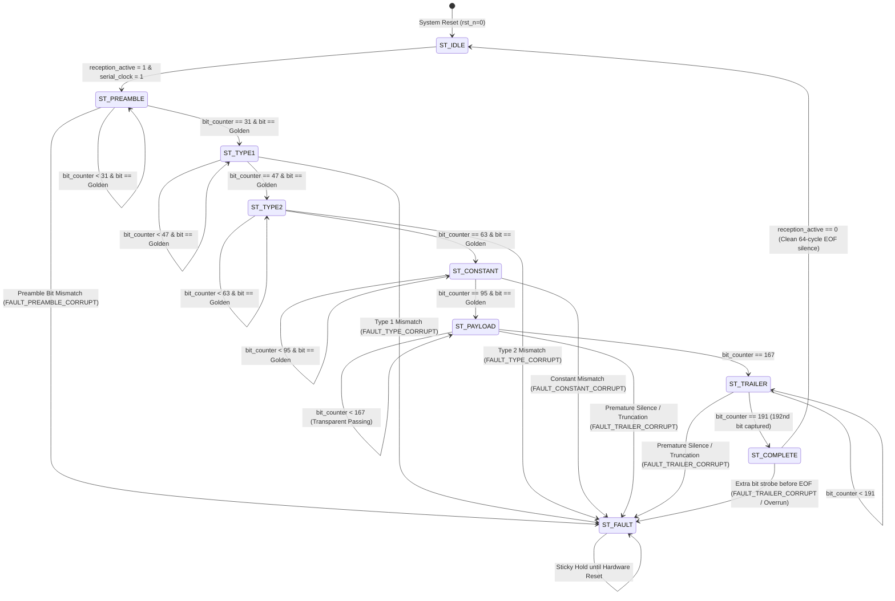

# ARES-RX Sentinel — Autonomous 192-bit Protocol FSM Architecture
## Document: `06_Demonstration/ARES-RX_Sentinel/figures/03_protocol_fsm_state_diagram.md`
**Verilog Implementation:** `ares_sentinel/ares_frame_fsm.v`  
**Frame Geometry:** Exactly 192 Bits ($24\,\text{Bytes}$)  
**Bit Counter:** Autonomous Hardware Counter ($0 \le \text{bit\_counter} \le 191$)  

---

## 1. Frame Geometry & Syntax Specification

The Layer-2 Syntax Monitor implements strict hardware grammar enforcement over the demodulated bitstream:

```text
Bits:
 0          31 32       47 48       63 64          95 96               167 168        191
+-------------+-----------+-----------+--------------+--------------------+--------------+
|  Preamble   |  Type 1   |  Type 2   |   Constant   |  Dynamic Payload   |   Trailer    |
| (32 bits)   | (16 bits) | (16 bits) |  (32 bits)   |     (72 bits)      |  (24 bits)   |
| 0xAAAAAAAA  |  0xD391   |  0xD391   |  0x0DFFFFFE  | ID, Temps, State   | Boundary EOF |
+-------------+-----------+-----------+--------------+--------------------+--------------+
[-- IMMUTABLE FIXED FIELDS: 100% HARDWARE ENFORCED --][ TRANSPARENT PAYLOAD ][ ENFORCED END ]
```

---

## 2. State Transition Diagram



---

## 3. Autonomous Boundary Defense Mechanisms

### 3.1 Independence from Baseline `full` Level
Unlike legacy designs that depend on the baseline `full` flag, Sentinel maintains an **autonomous 8-bit synchronous counter (`bit_counter`)**:
- Counter increments strictly on validated `serial_clock` strobes while `reception_active` is asserted.
- Baseline `full` can freeze, hang, or glitch without impacting Sentinel's ability to count and enforce boundaries.

### 3.2 Truncation Trap (AV07-D / TC10)
If the transmitter ceases transmission prematurely (e.g. after only 100 bits):
- Layer 1 detects silence exceeding $N_{EOF} = 64$ clock cycles and deasserts `reception_active`.
- If `reception_active` drops while $\text{bit\_counter} < 191$, Layer 2 immediately asserts `frame_fault` with `FAULT_TRAILER_CORRUPT` (3'b111).
- Incomplete frames are purged; host receives zeroized data.

### 3.3 Overrun Trap (BOUND-1B / TC12)
If an attacker attempts a buffer-overflow injection by transmitting a 193rd bit strobe while the reception envelope is still active:
- Layer 2 transitions from `ST_COMPLETE` into `ST_FAULT` upon detecting the 193rd strobe.
- `FAULT_TRAILER_CORRUPT` is latched; host data bus is clamped to zero.
