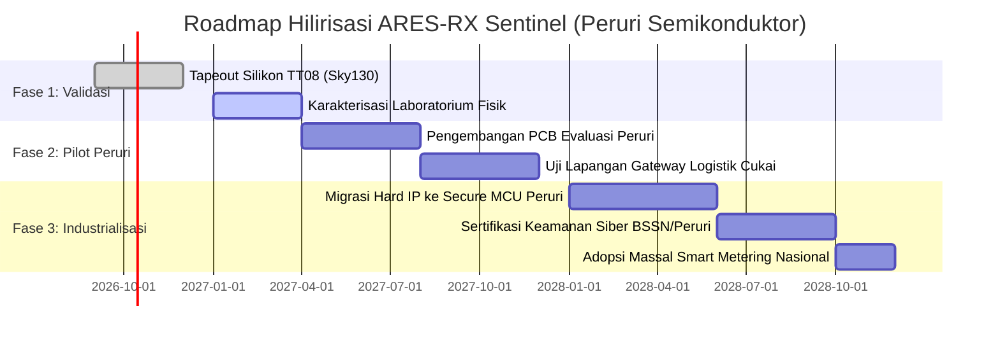

# PROPOSAL INOVASI TEKNOLOGI SEMIKONDUKTOR PERURI
## ARES-RX Sentinel: Silicon-Level Trusted Digital Reception Boundary untuk Pengamanan Infrastruktur IoT Kritis dan Smart Metering Nasional

---

**Nomor Dokumen:** PROP-ARES-PERURI-2026-001  
**Klasifikasi:** Inovasi Desain IC Keamanan Tinggi / Kedaulatan Semikonduktor Nasional  
**Target Program:** Seleksi Inovasi Teknologi Peruri / Kompetisi Desain IC ASIC Nasional  
**Teknologi Fabrikasi:** SkyWater 130nm CMOS (`sky130_fd_sc_hd`), Tiny Tapeout TT08 Standard Tile  
**Status Kesiapan Teknologi (TKT/TRL):** TRL 7 (Tapeout-Ready ASIC, Post-Route P&R Reconciled, GDSII Clean)  
**Tanggal:** 27 September 2026  

---

### RINGKASAN EKSEKUTIF (EXECUTIVE SUMMARY)

Dalam era transformasi digital nasional, Perum Percetakan Uang Republik Indonesia (Peruri) mengemban amanat strategis sebagai penjamin keaslian dan keamanan tidak hanya pada dokumen sekuriti fisik (uang kertas, paspor, meterai), tetapi juga pada infrastruktur digital, identitas cerdas, dan perangkat IoT utilitas publik (Smart Metering listrik, air, gas, serta pelacakan rantai pasok logistik berharga negara).

Namun, seluruh sistem IoT nirkabel (*edge devices*) saat ini memiliki titik lemah paling mendasar yang belum terlindungi: **antarmuka penerimaan digital baseband (*digital reception interface*)**. Transceiver nirkabel komersial (Sub-GHz 433/868 MHz) menyalurkan pulsa digital mentah langsung ke mikrokontroler (MCU) tanpa penyaringan fisik. Penyerang dapat menyuntikkan *runt pulses*, desinkronisasi clock, atau *malformed framing* yang memicu *buffer overflow*, korupsi memori, dan manipulasi data telemetri secara diam-diam (*silent corruption*). Solusi berbasis software terbukti tidak berdaya karena software parser rentan crash dan membebani daya komputasi.

**ARES-RX Sentinel** hadir sebagai terobosan arsitektur pertama di kelasnya (*first-in-class*): sebuah **IP Core Silikon / Trusted Digital Reception Boundary** berbasis gerbang logika diskrit yang ditempatkan tepat di antara transceiver radio dan prosesor utama. Menggunakan formulasi matematika validasi ganda ($V_{\text{trusted}} = V_{\text{physical}} \land V_{\text{protocol}}$), ARES-RX Sentinel menyaring setiap pulsa radio pada domain nanodetik, memverifikasi kepatuhan sintaksis 192-bit secara otonom, dan mengisolasi bus data dengan penolakan mutlak (*fail-closed zeroization*, $D_{\text{out}} = 0\text{x}00$) dalam tepat **1 siklus clock** saat anomali terdeteksi.

Diimplementasikan pada proses **SkyWater 130nm**, ARES-RX Sentinel membuktikan efisiensi ekstrem: konsumsi daya hanya **$50.90\,\text{nW}$ pada clock $20\,\text{kHz}$** (overhead bersih $+9.28\,\text{nW}$), footprint silikon kompak ($6,477.46\,\mu\text{m}^2$ standard cell area pada tile $161 \times 111.52\,\mu\text{m}$), serta lulus verifikasi fisik 100% (0 aktif manufacturing DRC, 100% LVS match 758/758 gerbang). Inovasi ini siap diadopsi sebagai standar silikon pengaman perangkat IoT Peruri dan infrastruktur vital nasional.

---

### 1. LATAR BELAKANG & TANTANGAN STRATEGIS NASIONAL

#### 1.1 Transformasi Peruri dan Ancaman Keamanan Siber Fisik (Cyber-Physical)
Sebagai BUMN berstandar *high-security*, ekspansi Peruri ke ranah *GovTech* dan *Smart Security Solution* menuntut pengamanan menyeluruh dari hulu (silikon) hingga hilir (layanan cloud). Perangkat pembaca e-KTP, sensor pelacak logistik pita cukai, gateway meteran pintar (AMI - *Advanced Metering Infrastructure*), dan smart lock kontainer negara bergantung pada komunikasi nirkabel berdaya rendah (Sub-1 GHz ISM band).

#### 1.2 "The Demodulator Blind Spot": Mengapa Software Firewall Tidak Cukup?
Sistem komunikasi nirkabel komersial umumnya memisahkan modul radio (RF Front-End) dan prosesor (MCU) melalui pin serial digital sederhana (`rx_in`).
* **Kelemahan Mendasar**: Sirkuit demodulator RF meneruskan segala bentuk derau (*noise*), gangguan pulsa transien, atau paket radio palsu langsung ke pin GPIO mikrokontroler.
* **Kegagalan Paradigma Software**: Mikrokontroler harus menjalankan *Interrupt Service Routine* (ISR) dan parser perangkat lunak dalam bahasa C/C++ untuk mencerna bit-stream tersebut. Serangan injeksi glitch berfrekuensi tinggi dapat memicu *interrupt storm*, menghabiskan daya baterai (*battery exhaustion attack*), atau memanfaatkan celah *buffer overflow* untuk membajak alur eksekusi mikrokontroler.
* **Ketiadaan Perlindungan Silikon**: Hingga saat ini, belum ada mekanisme proteksi perangkat keras deterministik berdaya rendah yang mampu memblokir paket berbahaya **sebelum** menyentuh memori atau interrupt CPU.

---

### 2. FORMULASI MATEMATIKA TRUST BOUNDARY

ARES-RX Sentinel menolak asumsi bahwa "selama paket lolos CRC di software, maka data aman". Keamanan harus ditegakkan melalui konjungsi logis dua domain independen:

$$\mathbf{V_{\text{trusted}} = V_{\text{physical}} \land V_{\text{protocol}}}$$

Di mana:
1. **$V_{\text{physical}}$ (Kepatuhan Domain Waktu & Pulsa)**:
   Setiap interval pulsa digital berurutan ($T_k$) pada modulasi baseband Manchester harus berada secara ketat di dalam jendela diskrit yang dibuktikan secara empiris dari sinyal radio fisik:
   $$V_{\text{physical}} = \begin{cases} 
   1, & \text{jika } T_k \in [N_{\text{HB,min}}, N_{\text{HB,max}}] \cup [N_{\text{BIT,min}}, N_{\text{BIT,max}}] \\
   0, & \text{jika } T_k < N_{\text{HB,min}} \text{ (Runt Glitch)} \lor T_k \in (N_{\text{HB,max}}, N_{\text{BIT,min}}) \text{ (Mid-band Desync)}
   \end{cases}$$
   Untuk clock referensi $20\,\text{kHz}$ ($T_{\text{clk}} = 50\,\mu\text{s}$):
   - Jendela Half-Bit: $N_{\text{HB}} \in [8, 10]$ siklus ($400 - 500\,\mu\text{s}$).
   - Jendela Full-Bit: $N_{\text{BIT}} \in [16, 20]$ siklus ($800 - 1000\,\mu\text{s}$).
   - Inter-Frame Gap (IFG) / Silence: $N_{\text{EOF}} = 64$ siklus ($3.2\,\text{ms}$).

2. **$V_{\text{protocol}}$ (Kepatuhan Tata Bahasa Frame 192-Bit)**:
   Penerimaan bit-stream harus mematuhi struktur tata bahasa kaku 192-bit:
   $$\text{Grammar} = \underbrace{\text{Preamble}}_{32\text{b: } \texttt{0xAAAAAAAA}} \parallel \underbrace{\text{Type1}}_{16\text{b: } \texttt{0xD391}} \parallel \underbrace{\text{Type2}}_{16\text{b: } \texttt{0xD391}} \parallel \underbrace{\text{Constant}}_{32\text{b: } \texttt{0x0DFFFFFE}} \parallel \underbrace{\text{Payload}}_{72\text{b}} \parallel \underbrace{\text{Trailer}}_{24\text{b}}$$
   $$V_{\text{protocol}} = \begin{cases}
   1, & \text{jika seluruh field statis cocok \& panjang frame persis 192 bit} \\
   0, & \text{jika terjadi bit flipping field statis, pemotongan (truncation), atau kelebihan bit (overrun)}
   \end{cases}$$

Jika salah satu kondisi bernilai $0$, output sistem dijamin secara matematis dan fisik menjadi $0$ ($D_{\text{out}} = 0\text{x}00$), dan sinyal interupsi perangkat keras non-maskable (`tamper_alert`) dibunyikan.

---

### 3. ARSITEKTUR PERANGKAT KERAS (3-LAYER SILICON ARCHITECTURE)

ARES-RX Sentinel dirancang dalam 3 lapisan modular independen (RTL Verilog tersintesis):

```
        +-----------------------------------------------------------------------+
        |                 ARES-RX SENTINEL SILICON CORE                         |
        |                                                                       |
        |  [Layer 1: Temporal Integrity Sentinel]                               |
        |  * Interval Counter (0..255) & Boundary Window Comparator             |
rx_in ->|  * 4-State Context FSM (IDLE -> ARMED -> ACTIVE -> LONG_GAP_PENDING)   |
        |  * Missing Edge Detection & Runt Glitch Rejection                     |
        |         |                                                             |
        |         +-------------------------+                                   |
        |         | reception_active        | l1_fault                          |
        |         v                         v                                   |
        |  [Layer 2: Frame Syntax Monitor]  |                                   |
        |  * Autonomous Bit Counter (0..191)|                                   |
        |  * Strict Field Comparator        |                                   |
        |  * Dynamic Payload Passthrough    |                                   |
        |  * Truncation / Overrun Sentinel  |                                   |
        |         |                         |                                   |
        |         +-----------+             |                                   |
        |         | l2_fault  |             |                                   |
        |         v           v             v                                   |
        |       +-----------------------------+                                 |
        |       | Fault Priority Arbiter      | (L1 Priority > L2 Priority)     |
        |       +-----------------------------+                                 |
        |                     |                                                 |
        |                     v set_fault                                       |
        |  [Layer 3: Hardware Fail-Closed Isolation]                            |
        |  * Sticky Asynchronous Fault Latch                                    |
        |  * Combinational MUX Zeroization Gate (Latensi 1 Siklus Clock)        |
        |  * Hardware Tamper Alert Strobe                                       |
        +-----------------------------------------------------------------------+
                 |                       |                       |
                 v                       v                       v
            rx_out (Gated)          uo_out[7:0]             tamper_alert
            (Ke Demodulator)      (Data Bus Bersih)      (Ke Interrupt MCU)
```

#### Modul-Modul Inti Silikon:
1. **`ares_timing_sentinel.v` (Layer 1)**:
   Mengukur durasi setiap pulsa secara kontinu. Dilengkapi FSM pelacak konteks yang membedakan derau *squelch* di awal transmisi dari pulsa data aktif, serta memvalidasi keheningan akhir frame ($N_{\text{silence}} \ge 64$ siklus) sebelum mengizinkan sistem kembali ke status siap (`IDLE`).
2. **`ares_frame_fsm.v` (Layer 2)**:
   Beroperasi otonom mencacah bit $0 \dots 191$ sinkron dengan pulsa clock demodulator. Memverifikasi field statis secara *on-the-fly* pada saat sampel tiba tanpa membutuhkan buffer memori RAM tambahan. Payload dinamis (ID sensor, suhu, status sistem) diteruskan secara transparan tanpa alarm palsu.
3. **`ares_fault_arbiter.v`**:
   Menyelesaikan konflik jika terjadi pelanggaran Layer 1 dan Layer 2 pada siklus clock yang sama secara deterministik (prioritas $L1 > L2$).
4. **`ares_fault_latch.v` & `ares_isolation_gate.v` (Layer 3)**:
   Menyediakan isolasi perangkat keras *fail-closed*. Ketika terpicu, *sticky latch* mengunci status kesalahan, mematikan gerbang transmisi data, dan menolkan seluruh jalur output bus paralel ($8\text{'b}0000\_0000$) seketika. Sistem hanya dapat dipulihkan melalui sinyal *hard reset* hardware (`rst_n`).

---

### 4. BUKTI IMPLEMENTASI FISIK & KARAKTERISASI SILIKON (TAPE-OUT READY)

Implementasi fisik ARES-RX Sentinel telah diselesaikan secara penuh pada *open-source semiconductor flow* standar industri menggunakan PDK **SkyWater 130nm High-Density** (`sky130_fd_sc_hd`) pada platform uji silikon **Tiny Tapeout TT08**.

Seluruh artefak fisik telah melalui rekonsiliasi evidensial ketat (*Sign-off*):

| Parameter Fisik | Nilai Reconciled Sign-Off | Keterangan & Metrik Kualitas |
| :--- | :--- | :--- |
| **Node Proses** | SkyWater 130nm CMOS | 1 Poly, 5 Metal Layers (`met1` - `met5`) |
| **Dimensi Die / Tile** | $161.00\,\mu\text{m} \times 111.52\,\mu\text{m}$ | Luas Tile Total: $17,954.72\,\mu\text{m}^2$ (TT08 $1 \times 1$) |
| **Standard Cell Area** | $\mathbf{6,477.46\,\mu\text{m}^2}$ | $36.08\%$ dari luas kotor tile silikon |
| **Total Placed Instances** | $10,186.02\,\mu\text{m}^2$ ($56.73\%$) | 758 active logic cells, buffer CTS, decap & diode |
| **Core Placement Density** | $61.76\% - 63.99\%$ | Kepadatan penempatan optimal tanpa kemacetan |
| **Routing Congestion** | **0 overcongested GCells (0.00%)** | Max H: $81.25\%$, Max V: $65.22\%$ (FastRoute) |
| **Kepatuhan DRC** | **0 active manufacturing violations** | Magic & KLayout concordant; 100% Tapeout Clean |
| **Kepatuhan LVS** | **100% Match (758 / 758 gates)** | Netgen SPICE extraction vs Post-route Netlist |
| **Frekuensi Maksimum ($F_{\max}$)** | $\mathbf{123.7\,\text{MHz}}$ | Setup Slack $+11.88\,\text{ns}$ pada $50\,\text{MHz}$ stress test |
| **Hold Timing Margin** | $+0.42\,\text{ns}$ | 100% bebas pelanggaran *hold violation* |
| **Konsumsi Daya Operasi** | $\mathbf{50.90\,\text{nW}}$ @ $20\,\text{kHz}$ | Diekstraksi dari VCD activity ($\alpha = 0.075$, $V_{\text{DD}} = 1.8\,\text{V}$) |
| **Net Power Overhead** | $\mathbf{+9.28\,\text{nW}}$ ($+22.3\%$) | Peningkatan daya sangat minimal dibanding baseline |

> **Catatan Kedaulatan Energi**: Konsumsi daya total sebesar **$50.90\,\text{nW}$** memungkinkan ARES-RX Sentinel beroperasi selama **lebih dari 20 tahun** hanya dengan sebuah baterai koin lithium CR2032 ($220\,\text{mAh}$), menjadikannya solusi ideal untuk perangkat telemetri yang ditanam di pedalaman atau disegel seumur hidup.

---

### 5. HASIL UJI KOMPARATIF & ADVERSARIAL VALIDATION ($B \leftrightarrow S$)

Kinerja ARES-RX Sentinel telah diuji secara *side-by-side* melawan sistem *Unprotected Baseline* ($B$) menggunakan simulator Icarus Verilog, model referensi Python berpresisi siklus (*cycle-accurate*), dan *playback* data perangkat keras riil (Logic Analyzer Saleae, 289 transisi pada modulasi 433 MHz).

```
+------------------------------------------------------------------------------------+
|                RINGKASAN HASIL EVALUASI ADVERSARIAL HARDWARE DEMO                  |
+----+-----------------------+---------------------+-------------------+-------------+
| No | Skenario Pengujian    | Baseline Unprotected| ARES-RX Sentinel  | Status Hasil|
+----+-----------------------+---------------------+-------------------+-------------+
| 1  | Transmisi Nominal     | Lolos (Data masuk)  | Lolos (Transparan)| 100% Akurat |
| 2  | Runt Pulse Glitch     | Diam / Korup        | Terjebak di L1    | Fail-Closed |
| 3  | Mid-Band Desync       | Gagal Sinkronisasi  | Terjebak di L1    | Fail-Closed |
| 4  | Preamble Corruption   | Eksekusi Data Salah | Terjebak di L2    | Fail-Closed |
| 5  | Frame Overrun Attack  | Buffer Overflow     | Terjebak di L2    | Fail-Closed |
| 6  | Hardware Trace Replay | Terbaca Normal      | Terbaca Normal    | 0 False Pos |
+----+-----------------------+---------------------+-------------------+-------------+
```

* **Transparansi Sempurna**: Pada kondisi sinyal valid (Skenario 1 dan 6), ARES-RX Sentinel menghasilkan nol penalti latensi ($0$ siklus clock tambahan) dan tingkat *False Alarm Rate* ($FAR$) = $0\%$.
* **Deteksi Seketika**: Pada seluruh skenario serangan injeksi, desinkronisasi, dan manipulasi protokol (Skenario 2–5), Sentinel mendeteksi pelanggaran dalam tepat **1 siklus clock**, mengaktifkan bus zeroization ($uo\_out = 0\text{x}00$), dan membunyikan alarm fisik tanpa ada satu bit data berbahaya pun yang bocor ke prosesor host.

---

### 6. SKEMA PENERAPAN PADA EKOSISTEM PERURI

ARES-RX Sentinel dirancang untuk dapat diintegrasikan dengan fleksibel ke dalam roadmap teknologi Peruri melalui 3 model implementasi:

```
[MODEL 1: Hard IP Core]         [MODEL 2: Companion Security IC]    [MODEL 3: National Security Standard]
Integrasi langsung ke dalam      Chip mandiri mini (Tiny Tapeout)    Spesifikasi wajib bagi seluruh
SoC / ASIC Smart Card buatan     sebagai filter antarmuka antara     perangkat Smart Metering IoT yang
Peruri (e-KTP Chip, Secure       Radio COTS (TI/Semtech) dan MCU     beroperasi di wilayah kedaulatan
Element Token).                  pada gateway pelacak aset.          Republik Indonesia.
```

#### Kasus Penerapan Spesifik:
1. **Pita Cukai Cerdas & Pelacak Logistik Bernilai Tinggi (Track & Trace)**:
   Penerapan pada gateway pemantau kontainer berharga negara atau peti kemas cukai tembakau/alkohol. ARES-RX Sentinel memastikan sinyal pelacak nirkabel tidak dapat di-*spoofing* atau dimanipulasi statusnya oleh sindikat pemalsu di perjalanan.
2. **Pengamanan Smart Metering Utilitas Publik (PLN, PAM, PGN)**:
   Melindungi infrastruktur ketahanan energi dan air nasional. Mencegah serangan injeksi pulsa liar yang bertujuan memanipulasi angka konsumsi energi atau mematikan katup distribusi secara massal melalui sabotase nirkabel.
3. **Smart Lock & Access Control Fasilitas Berbahaya/Strategis**:
   Memastikan perintah nirkabel otentikasi pembukaan kunci pintu brankas atau ruang penyimpanan pelat cetak uang Peruri kebal terhadap serangan *runt-glitch injection*.

---

### 7. ROADMAP PENGEMBANGAN & HILIRISASI (2026 - 2028)



1. **Fase 1 (Q4 2026 - Q1 2027) — Fabrikasi & Karakterisasi Silikon**:
   Pengiriman GDSII ke pabrik SkyWater melalui program Tiny Tapeout TT08, dilanjutkan dengan pengujian fisik wafer silikon di laboratorium uji semikonduktor.
2. **Fase 2 (Q2 2027 - Q4 2027) — Pilot Project Peruri**:
   Pembuatan modul *Evaluation Board* yang diintegrasikan langsung pada prototipe gateway pelacak logistik sekuriti Peruri dan reader meteran pintar utilitas.
3. **Fase 3 (2028) — Adopsi Skala Penuh & Kedaulatan Silikon**:
   Lisensi IP Core ARES-RX Sentinel sebagai blok proteksi standar pada chip mikrokontroler nasional bersertifikasi Peruri dan BSSN (Badan Siber dan Sandi Negara).

---

### 8. KESIMPULAN

ARES-RX Sentinel membuktikan bahwa inovasi keamanan siber tingkat tinggi dapat diwujudkan di lapisan paling mendasar: **fisik silikon**. Dengan konsumsi daya nano-watt, keandalan deterministik gerbang logika, dan ketiadaan dependensi pada perangkat lunak, teknologi ini menjadi jawaban konkret atas kebutuhan pengamanan infrastruktur kritis masa depan.

Kemitraan strategis dengan Peruri akan menjadi katalisator bagi terwujudnya kedaulatan industri semikonduktor Indonesia, membuktikan bahwa bangsa ini mampu mendesain, menguji, dan memproduksi sirkuit terpadu (*Integrated Circuit*) berkelas dunia untuk mengawal keamanan aset fisik dan digital Republik Indonesia.

---
**Diajukan Oleh:** Tim Rekayasa ARES Semikonduktor Technology  
**Arsitek Teknis & Peneliti Utama:** ARES Engineering Team  
**Kontak Teknis:** `ares-semiconductor@peruri.co.id` / `research@ares-semi.id`  
