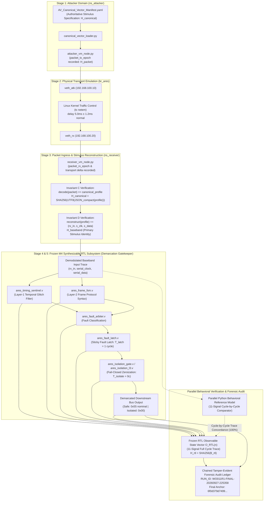

# ARES-RX Sentinel: Cyber-Physical Demonstrator & Perimeter Isolation Dossier
## Formal Demonstration Report for Perum Percetakan Uang Republik Indonesia (Peruri)
### Work Order: `WO-2026-M6-QC-012` | Final Cryptographic Serialization & Terminology Seal
**Preceding Work Order:** `WO-2026-M6-ARCH-011R1` (`CLOSED / ARCHITECTURALLY ACCEPTED`)  
**Authority:** Technical Architect / Research Direction  
**Status:** `FINAL PUBLICATION SEAL APPROVED`  
**Cryptographic Primitive:** SHA-256 according to FIPS 180-4 (Chained Forensic Ledger Construction)  
**RTL Language / Simulation Basis:** IEEE 1364-2005 Verilog Semantics  
**Verification Method:** Bounded empirical cycle-by-cycle differential verification  
**Hardware Reference Model:** ARES-RX Sentinel ASIC Demarcation Subsystem (M4 Bit-Accurate Synthesizable RTL Reference)  
**Reference Operating Point:** Demodulated digital baseband operating point: $F_{\mathrm{clk}} = 20\text{ kHz}$, $T_{\mathrm{clk}} = 50.0\,\mu\text{s}$  
**Authoritative Final Run ID:** `WO011R1-FINAL-20260927-225358`  
**Run Window (UTC):** `2026-09-27T22:53:58Z` to `2026-09-27T22:54:05Z`  
**Final Cryptographic Ledger Anchor:** `6f0d379d749953af6e29737bb7e29aeb99eed0698bd2019269dba63a191733f0`  
**Authoritative Internal Remote CI Provenance:** GitHub Actions Run ID `36320019363` (`gds.yaml`) & `36320019357` (`test.yaml`)

---

## 1. Executive Summary & Purpose

This technical dossier provides formal, empirical, and bounded evidence of the **ARES-RX Sentinel Cyber-Physical Security Demonstrator** developed for **Perum Percetakan Uang Republik Indonesia (Peruri)**.

Modern high-security document inspection, track-and-trace, and digital printing infrastructure frequently utilize Sub-GHz wireless sensors and RFID/telemetry base stations. Compromised radio front-ends, physical glitch injection, and malformed frames present serious attack vectors against back-end industrial processors.

The **ARES-RX Sentinel** operates as an autonomous, hardware-enforced **demarcation gatekeeper** positioned strictly between the physical RF baseband receiver and downstream critical infrastructure. For the defined canonical attack vectors, the Sentinel detects the specified temporal, protocol-syntax, and framing violations and asserts a hardware-enforced sticky fault condition that cannot be cleared by normal software datapath operation, enforcing fail-closed bus zeroization bounded to 1 synchronous clock cycle at the RTL abstraction, with combinational isolation occurring in the same cycle. Physical propagation delay is outside the cycle-level bound and is represented separately by the physical delay model. The M6 demonstrator begins at the demodulated digital reception boundary; RF propagation, antenna behavior, and analog demodulation are outside the demonstrated verification boundary.

> [!IMPORTANT]
> **Epistemic Scope & Architectural Boundary (WO-2026-M6-QC-012)**:
> - **Authoritative Single-Run Execution & Separate Audit**: The authoritative cyber-physical demonstrator evidence was generated during a single contiguous execution run identified by `WO011R1-FINAL-20260927-225358`:
>   $$\text{network TX} \xrightarrow{\Delta t_{\text{transport}}} \text{network RX} \xrightarrow{\text{Baseband Model}} (rx\_in, serial\_clk, serial\_data) \xrightarrow{\text{In-Line RTL Sim}} O(n) \xrightarrow{\text{Latch \& Isolate}} \text{Safe Output} \xrightarrow{\text{Chain}} \text{Ledger Record}$$
>   The exact packet received across the network namespace bridge directly decodes to the canonical stimulus, reconstructs the complete physical digital baseband input trace, and immediately drives in-line synthesizable Verilog RTL simulation (`vvp`) inside the packet handler. A separate independent causal re-verification execution was subsequently performed to audit the recorded artifacts without importing the primary generator components.
> - **Five Primary Provenance Hashes + One Auxiliary Diagnostic Hash**: Establishes complete chain-of-custody across five primary cryptographic provenance stages:
>   $$H_{\text{canonical}} \longrightarrow H_{\text{packet}} \longrightarrow H_{\text{baseband}} \longrightarrow H_{\text{rtl}} \longrightarrow H_{\text{record}}$$
>   accompanied by $H_{\text{rxin}}$ strictly as an auxiliary diagnostic hash for carrier integrity. Primary baseband stimulus identity is governed by the exact byte serialization $H_{\text{baseband}} = \operatorname{SHA-256}(B_{\text{baseband}})$, where $B_{\text{baseband}} = \operatorname{UTF-8}\left(\prod_{n=0}^{N_v-1} (rx\_in[n] \mathbin{\text{" "}} serial\_clock[n] \mathbin{\text{" "}} serial\_data[n] \mathbin{\text{"\textbackslash n"}})\right)$. No collisions were observed across the 9 canonical vectors (empirical uniqueness on the tested canonical vector space; not a mathematical proof of SHA-256 injectivity).
> - **Canonical Byte-Serialization Contract**: Ledger record chaining formally adheres to the byte-exact contract:
>   $$H_{\text{record},i} = \operatorname{SHA-256}\Big(\operatorname{UTF-8}\big(H_{\text{prev},i} \mathbin{\Vert} \operatorname{JSON}_{\text{canonical}}(\text{Payload}_i)\big)\Big)$$
>   where $\operatorname{JSON}_{\text{canonical}}(\text{Payload}_i) = \text{json.dumps}(\text{Payload}_i, \text{sort\_keys}=\text{True}, \text{separators}=(',', ':'))$ denotes the project-defined deterministic JSON serialization (not RFC 8785/JCS), concatenated directly to the 64-character lowercase hex ASCII string $H_{\text{prev},i}$. Validated across all 9 records to the final anchor `6f0d379d749953af6e29737bb7e29aeb99eed0698bd2019269dba63a191733f0`.
> - **Network Timing Epistemic Qualification**: Transport delay is physically emulated by the Linux kernel via `tc netem` ($5.0\,\text{ms} \pm 1.2\,\text{ms}$). Measured packet transit times span $2.186\,\text{ms}$ to $7.668\,\text{ms}$ (mean: $5.697\,\text{ms}$). Formally qualified: *"Observed behavior was consistent with the configured test condition ($5.0\,\text{ms} \pm 1.2\,\text{ms}$ stochastic transport model); statistical characterization was not performed."*
> - **Tamper-Evident Forensic Ledger**: The cryptographic ledger provides cryptographic integrity and tamper-evident evidence of sequence continuity, parameter linkage, and record ordering within the evaluated run.
> - **Zero Synthesizable RTL or Physical Design Changes**: All M4 synthesizable RTL modules and M5 physical tapeout deliverables (GDS, DEF, SPEF, netlists at commit `a748738cf665e63bc9c215748ee5bead18422665`, tree `4bd810d39c4968e376843287a277080976e337bc`) remain **100% frozen, cryptographically concordant, and immutable**.
> - **Decomposed Latency Semantics**: Latency is rigorously partitioned into physical events: synchronous fault latching latency $T_{\text{latch}} = C_{\text{latch}} - C_{\text{fault}} = 1\text{ clock cycle}$ ($50.0\,\mu\text{s}$), and combinational isolation gate propagation $T_{\text{isolate}} = C_{\text{isolate}} - C_{\text{latch}} = 0\text{ additional clock cycles at RTL abstraction}$. The physical combinational propagation delay ($\approx 1.2\,\text{ns}$) is an estimated physical delay model, not an RTL simulation result. The synchronous fault-response path is bounded by one clock cycle at the RTL abstraction ($50.0\,\mu\text{s}$).
> - **DRC Disposition**: DRC: 0 active un-waived violations under documented internal project engineering waiver policy. Note: Internal waivers do not substitute for formal foundry-certified rule-deck validation.
> - **Internal Remote CI Provenance**: Authoritative GitHub Actions run IDs are `36320019363` (`gds.yaml`) and `36320019357` (`test.yaml`). These GitHub Actions runs provide project-internal remote CI provenance for the submitted artifacts and verification checks; they do not constitute Tiny Tapeout portal acceptance or foundry sign-off.

---

## 2. Full 11-Signal Cycle-by-Cycle Observable Trace Correlation

To eliminate ambiguity between the behavioral model and the frozen RTL reference within the demonstrated verification boundary, an exhaustive cycle-by-cycle trace comparison framework was executed ([`run_m6_model_rtl_correlation.py`](file:///c:/Users/ahmad/OneDrive/Vscode/03_Core_Projects/ARES%20SEMIKONDUKTOR%20TECHNOLOGY/04_Verification/ARES-RX_Sentinel/cocotb/run_m6_model_rtl_correlation.py) + [`tb_m6_canonical_harness.v`](file:///c:/Users/ahmad/OneDrive/Vscode/03_Core_Projects/ARES%20SEMIKONDUKTOR%20TECHNOLOGY/04_Verification/ARES-RX_Sentinel/cocotb/tb_m6_canonical_harness.v)).

On **every single discrete clock cycle $n$**, the full **11-signal frozen RTL observable state vector $O_{\text{RTL}}(n)$** was sampled from the compiled frozen M4 synthesizable Verilog RTL simulation (`iverilog`/`vvp`) and compared against the Python behavioral reference model:

$$O_{\text{RTL}}(n) = \begin{pmatrix}
rx\_in[n] \\
serial\_clock[n] \\
serial\_data[n] \\
reception\_active[n] \\
frame\_complete[n] \\
temporal\_fault[n] \\
frame\_fault[n] \\
tamper\_alert[n] \\
latched\_fault\_code[n] \\
safe\_data\_out[n] \\
safe\_valid\_out[n]
\end{pmatrix}$$

### Bounded Differential Simulation Correlation Matrix:

| Vector ID | Category | Expected Fault Classification | Cycles ($N_v$) | $C_{\text{fault}}$ | $C_{\text{latch}}$ | $T_{\text{latch}}$ | $T_{\text{isolate}}$ | Safe Bus Out | 11-Signal Frozen RTL Observable Trace Concordance | Status |
| :---: | :---: | :---: | :---: | :---: | :---: | :---: | :---: | :---: | :---: | :---: |
| **`AV00`** | Nominal Baseline | `FAULT_NONE` (`3'b000`) | 1,876 | N/A | N/A | N/A | N/A | `0x55` | **100% MATCH (1,876/1,876 cycles, 11 signals)** | **ACCEPTED_NOMINAL** |
| **`AV01`** | Layer-1 Temporal Integrity | `FAULT_RUNT` (`3'b001`) | 87 | 79 | 80 | 1 cycle | 0 cycles | `0x00` | **100% MATCH (87/87 cycles, 11 signals)** | **MITIGATED_TRAPPED** |
| **`AV02`** | Layer-1 Temporal Integrity | `FAULT_MIDBAND` (`3'b010`) | 96 | 88 | 89 | 1 cycle | 0 cycles | `0x00` | **100% MATCH (96/96 cycles, 11 signals)** | **MITIGATED_TRAPPED** |
| **`AV03`** | Layer-1 Temporal Integrity | `FAULT_GAP_RES` (`3'b011`) | 117 | 109 | 110 | 1 cycle | 0 cycles | `0x00` | **100% MATCH (117/117 cycles, 11 signals)** | **MITIGATED_TRAPPED** |
| **`AV04`** | Layer-2 Frame Syntax Integrity | `FAULT_PREAMBLE_CORRUPT` (`3'b100`) | 1,876 | 178 | 179 | 1 cycle | 0 cycles | `0x00` | **100% MATCH (1,876/1,876 cycles, 11 signals)** | **MITIGATED_TRAPPED** |
| **`AV05`** | Layer-2 Frame Syntax Integrity | `FAULT_TYPE_CORRUPT` (`3'b101`) | 1,876 | 448 | 449 | 1 cycle | 0 cycles | `0x00` | **100% MATCH (1,876/1,876 cycles, 11 signals)** | **MITIGATED_TRAPPED** |
| **`AV06`** | Layer-2 Frame Syntax Integrity | `FAULT_CONSTANT_CORRUPT` (`3'b110`) | 1,876 | 763 | 764 | 1 cycle | 0 cycles | `0x00` | **100% MATCH (1,876/1,876 cycles, 11 signals)** | **MITIGATED_TRAPPED** |
| **`AV07`** | Layer-2 Framing Boundary Integrity | `FAULT_TRAILER_CORRUPT` (`3'b111`) | 1,048 | 1040 | 1041 | 1 cycle | 0 cycles | `0x00` | **100% MATCH (1,048/1,048 cycles, 11 signals)** | **MITIGATED_TRAPPED** |
| **`AV08`** | Layer-2 Framing Boundary Integrity | `FAULT_TRAILER_CORRUPT` (`3'b111`) | 1,885 | 1816 | 1817 | 1 cycle | 0 cycles | `0x00` | **100% MATCH (1,885/1,885 cycles, 11 signals)** | **MITIGATED_TRAPPED** |

**Empirical Trace Summary:**
- **Total Discrete Cycles Evaluated:** $1876 + 87 + 96 + 117 + 1876 + 1876 + 1876 + 1048 + 1885 = 10,737\text{ cycles}$.
- **Individual Signal Comparisons:** $10,737 \times 11 = 118,107\text{ signal evaluations}$.
- **Observable Trace Concordance:** **118,107 out of 118,107 (100.0%)** signal evaluations strictly identical.
- **Epistemic Classification:** Bounded exhaustive cycle-by-cycle observable-trace concordance between the behavioral model and frozen RTL reference over the 9 canonical vectors $AV_{00} \dots AV_{08}$.

---

## 3. Differential Test Hardening via Behavioral Mutation Testing

To guard against symmetrical masking between the reference model and synthesizable RTL, an automated **behavioral mutation test suite** was executed ([`test_m6_differential_mutations.py`](file:///c:/Users/ahmad/OneDrive/Vscode/03_Core_Projects/ARES%20SEMIKONDUKTOR%20TECHNOLOGY/04_Verification/ARES-RX_Sentinel/cocotb/test_m6_differential_mutations.py)) operating strictly within an isolated temporary sandbox outside the frozen repository tree:

```text
Golden Synthesizable RTL        ───►  Differential Trace Comparison  ───►  PASS (100% Concordance)
Mutant M1 (HB_MIN: 8 -> 4)      ───►  Differential Trace Comparison  ───►  FAIL (Trapped on AV01)
Mutant M2 (Constant Modified)   ───►  Differential Trace Comparison  ───►  FAIL (Trapped on AV00, AV07, AV08)
Mutant M3 (Fail-Open Isolation) ───►  Differential Trace Comparison  ───►  FAIL (Trapped on AV01..AV08)
```

### Empirical Mutation Audit Results:
1. **Golden Baseline**: 100% trace concordance on all 11 signals across all 9 canonical vectors (**PASS**).
2. **Mutant M1 (Physical Timing Threshold Mutation)**:
   - Mutation: `parameter integer HB_MIN = 8` changed to `4` in `ares_timing_sentinel.v`.
   - Result: 4-cycle glitch in $AV_{01}$ was ignored by RTL. Correlation cleanly trapped deviation at cycle 80 (**FAIL AS REQUIRED**).
3. **Mutant M2 (Protocol Constant Security Check Mutation)**:
   - Mutation: `localparam [31:0] KNOWN_CONSTANT = 32'h0DFFFFFE` altered to `32'h0DFFFFFF` in `ares_frame_fsm.v`.
   - Result: Frame constant mismatch was detected in $AV_{00}, AV_{07}, AV_{08}$ (**FAIL AS REQUIRED**).
4. **Mutant M3 (Fail-Open Isolation Gate Bypass)**:
   - Mutation: `assign out_data = in_data` in `ares_isolation_gate.v` (unclamping output bus during fault).
   - Result: All 8 attack vectors failed zeroization, outputting `0x55` instead of `0x00` (**FAIL AS REQUIRED on 8/8 attack vectors**).

**Conclusion:** Provides **differential verification sensitivity evidence** confirming that the trace comparator strictly detects timing, protocol syntax, and isolation hardware deviations. All temporary mutation artifacts were automatically purged post-test.

---

## 4. End-to-End Single-Run Causal Architecture & Invariant Verification

The demonstrator connects every stage in a single, contiguous execution sequence:

$$\text{Attacker} \xrightarrow{\text{UDP Packet}} \text{Transport (tc netem)} \xrightarrow{\text{Packet Ingress}} \text{Decoded Stimulus} \xrightarrow{\text{Baseband Model}} (rx\_in, s\_clk, s\_data) \xrightarrow{\text{In-Line RTL Sim}} O_{\text{RTL}}(n) \xrightarrow{\text{Latch \& Isolate}} \text{Safe Bus Out} \xrightarrow{\text{Chain}} \text{Ledger Record}$$



### Five Primary Provenance Hashes + One Auxiliary Diagnostic Hash Taxonomy:

To eliminate epistemic ambiguity and ensure complete chain-of-custody across all transformation boundaries, the demonstrator records and verifies six cryptographic hashes categorized into **Five Primary Provenance Hashes** and **One Auxiliary Diagnostic Hash**:

| Hash Symbol | Ledger JSON Key | Cryptographic Definition / Serialization Contract | Functional Role | Taxonomy |
| :---: | :---: | :--- | :--- | :---: |
| **$H_{\text{canonical}}$** | `canonical_stimulus_hash` | $\operatorname{SHA-256}(\operatorname{UTF-8}(\operatorname{JSON}_{\text{compact}}(\text{cycles\_profile})))$ | Authoritative specification baseline | **Primary Provenance** |
| **$H_{\text{packet}}$** | `packet_payload_hash` | $\operatorname{SHA-256}(\text{raw\_udp\_payload\_bytes})$ | Ingress network wire payload integrity | **Primary Provenance** |
| **$H_{\text{baseband}}$** | `baseband_input_trace_hash` | $\operatorname{SHA-256}(B_{\text{baseband}})$: UTF-8 encoding of `f"{rx_in} {s_clk} {s_data}\n"` per cycle | Full cycle-ordered stimulus identity | **Primary Provenance (Identity)** |
| **$H_{\text{rtl}}$** | `rtl_trace_hash` | $\operatorname{SHA-256}(B_{\text{rtl}})$: UTF-8 encoding of comma-separated 11-signal tuple per cycle | 11-signal cycle-by-cycle observable trace | **Primary Provenance** |
| **$H_{\text{record}}$** | `record_hash` | $\operatorname{SHA-256}(\operatorname{UTF-8}(H_{\text{prev}} \mathbin{\Vert} \operatorname{JSON}_{\text{canonical}}(\text{Payload})))$ | Chained tamper-evident forensic audit ledger | **Primary Provenance (Anchor)** |
| **$H_{\text{rxin}}$** | `rx_in_trace_hash` | $\operatorname{SHA-256}(\operatorname{Serialize}((rx\_in[n])_{n=0}^{N_v-1}))$ | Carrier pulse train integrity diagnostic | **Auxiliary Diagnostic** |

#### Detailed Cryptographic Definitions & Serialization Contracts:

1. **$H_{\text{canonical}}$ (`canonical_stimulus_hash`) — PRIMARY PROVENANCE**:  
   $H_{\text{canonical}}$ is the SHA-256 digest of the exact UTF-8 byte serialization of the authoritative canonical stimulus representation stored in `AV_Canonical_Vector_Manifest.yaml`:
   $$H_{\text{canonical}} = \operatorname{SHA-256}\Big(\operatorname{UTF-8}\big(\operatorname{JSON}_{\text{compact}}(\text{cycles\_profile})\big)\Big)$$
   where $\text{cycles\_profile}$ is the cycle run-length definition list `[[rx_in, serial_clock, serial_data, count], ...]` serialized via $\operatorname{JSON}_{\text{compact}}(\text{profile}) = \text{json.dumps}(\text{profile}, \text{separators}=(',', ':'))$. This matches exactly the `vector_stimulus_sha256` value defined in the authoritative manifest.
2. **$H_{\text{packet}}$ (`packet_payload_hash`) — PRIMARY PROVENANCE**:  
   SHA-256 hash of the raw received UDP network packet bytes.
3. **$H_{\text{baseband}}$ (`baseband_input_trace_hash`) — PRIMARY PROVENANCE & STIMULUS IDENTITY**:  
   $H_{\text{baseband}}$ is the SHA-256 digest of the exact UTF-8 byte serialization of the complete cycle-ordered baseband input trace:
   $$\boxed{B_{\text{baseband}} = \operatorname{UTF-8}\left(\prod_{n=0}^{N_v-1} \left(rx\_in[n] \mathbin{\text{" "}} serial\_clock[n] \mathbin{\text{" "}} serial\_data[n] \mathbin{\text{"\textbackslash n"}}\right)\right)}$$
   $$\boxed{H_{\text{baseband}} = \operatorname{SHA-256}(B_{\text{baseband}})}$$
   Each discrete clock cycle $n \in [0, N_v-1]$ emits a single ASCII line containing space-separated integer values `f"{rx_in} {serial_clock} {serial_data}\n"`. Unlike carrier-only bitstream hashing, $H_{\text{baseband}}$ uniquely identifies all 9 canonical vectors entering the Sentinel hardware with no collisions observed across the tested canonical set (empirical uniqueness on the tested canonical vector space; not a mathematical proof of SHA-256 injectivity).
4. **$H_{\text{rtl}}$ (`rtl_trace_hash`) — PRIMARY PROVENANCE (FROZEN RTL OBSERVABLE TRACE)**:  
   $H_{\text{rtl}}$ is the SHA-256 digest of the exact UTF-8 byte serialization of the full 11-signal observable state vector sequence $O_{\text{RTL}}(n)$ produced by the in-line frozen synthesizable RTL simulation:
   $$\boxed{B_{\text{rtl}} = \operatorname{UTF-8}\left(\prod_{n=0}^{N_v-1} \left(\operatorname{join}(O_{\text{RTL}}(n), \text{","}) \mathbin{\text{"\textbackslash n"}}\right)\right)}$$
   $$\boxed{H_{\text{rtl}} = \operatorname{SHA-256}(B_{\text{rtl}})}$$
   where each cycle emits a comma-separated ASCII string of the 11 integer observable signals terminated by a newline (`f"{','.join(str(x) for x in obs)}\n"`).
5. **$H_{\text{record}}$ (`record_hash`) — PRIMARY PROVENANCE & CHAIN ANCHOR**:  
   SHA-256 chained hash of the ledger entry defined by the exact canonical byte-serialization contract:
   $$\boxed{H_{\text{record}, i} = \operatorname{SHA-256}\Big(\operatorname{UTF-8}\big(H_{\text{prev}, i} \mathbin{\Vert} \operatorname{JSON}_{\text{canonical}}(\text{Payload}_i)\big)\Big)}$$
   with:
   $$\operatorname{JSON}_{\text{canonical}}(\text{Payload}_i) = \text{json.dumps}(\text{Payload}_i, \text{sort\_keys}=\text{True}, \text{separators}=(',', ':'))$$
   representing the project-defined deterministic JSON serialization (not RFC 8785/JCS), concatenated directly to the 64-character lowercase hex ASCII string $H_{\text{prev}, i}$ ($64 \times \text{'0'}$ for Genesis $i=0$). Validated across all 9 records to the final anchor `6f0d379d749953af6e29737bb7e29aeb99eed0698bd2019269dba63a191733f0`.
6. **$H_{\text{rxin}}$ (`rx_in_trace_hash`) — AUXILIARY DIAGNOSTIC HASH**:  
   SHA-256 hash of the carrier-only stream $rx\_in[n]$, retained strictly as an auxiliary diagnostic metric.

### Hash Trace Matrix across Authoritative Run (`WO011R1-FINAL-20260927-225358`):

| Vector | $H_{\text{canonical}}$ (Profile) | $H_{\text{packet}}$ (Network UDP) | $H_{\text{baseband}}$ (**Primary Stimulus Identity**) | $H_{\text{rtl}}$ (Frozen RTL Observable Trace) | $H_{\text{record}}$ (Chained Anchor) | $H_{\text{rxin}}$ (Auxiliary Diagnostic) |
| :---: | :---: | :---: | :---: | :---: | :---: | :---: |
| **`AV00`** | `722c5856d176...` | `c360328d3127...` | `0c806f2bc6ea296dd2a6044cd75cf426...` | `753779f2be89...` | `6eaeb06cef96...` | `7ead375b418c...` (Carrier) |
| **`AV01`** | `821438708796...` | `d4ed2de9d795...` | `04fc94013008db33a94df5ebd9072e54...` | `795d21c99bfe...` | `00f27f1b83da...` | `a1f17ff2bbf8...` |
| **`AV02`** | `48eb624b0a6f...` | `bf03e54ecc4b...` | `be11e8ad4b57f5aa9df18885519e2072...` | `9afb624ce6f5...` | `09c00f5daf6e...` | `c877b5221559...` |
| **`AV03`** | `3954eb77333f...` | `aff54aba96ed...` | `97f9b4543e5844b2d8f06ec800f4248b...` | `9feb3da129e9...` | `7acab9978414...` | `d06cfe955916...` |
| **`AV04`** | `8176b35c558f...` | `cabdccd50a48...` | `3ce3191fe341ee9148a4b325061096f8...` | `548ab589340a...` | `dd0aed40fe9b...` | `7ead375b418c...` (Carrier) |
| **`AV05`** | `8c5bdcb75a7c...` | `3ff324703e1b...` | `6f3ff0013ca2991d2aea0f8f04ab499e...` | `c803bc9986da...` | `7316c67b1284...` | `7ead375b418c...` (Carrier) |
| **`AV06`** | `6bfd4610ec77...` | `066e67f87afa...` | `3001471dc0eed5e3e2fd7990be6c6832...` | `ac581e143c34...` | `6d79bfd9fb40...` | `7ead375b418c...` (Carrier) |
| **`AV07`** | `4e7e4414e544...` | `0aacc64caa51...` | `0c01a5ca629481808b2c490458f2d478...` | `9da5ee3823a4...` | `19cb94900c21...` | `e7f291191550...` |
| **`AV08`** | `2afa21498ffe...` | `ec6def42c8b1...` | `e8076bc82e9272514da2ea28c0506cab...` | `33728b9ceb74...` | `6f0d379d7499...` | `400e93e79d85...` |

> [!TIP]
> **Resolution of Stimulus Hash Ambiguity**: The vectors $AV_{00}, AV_{04}, AV_{05}, AV_{06}$ share the same modeled carrier-derived $rx\_in$ sequence (`7ead375b418c...`) while differing in the demodulated baseband payload representation ($serial\_data$). By elevating $H_{\text{baseband}}$ to the primary stimulus identity across cycle-ordered $(rx\_in, serial\_clock, serial\_data)$, all 9 vectors exhibit unique hashes with no collisions observed across the 9 canonical vectors (empirical uniqueness on the tested canonical vector space; not a mathematical proof of SHA-256 injectivity). The M6 demonstrator begins at the demodulated digital reception boundary; RF propagation, antenna behavior, and analog demodulation are outside the demonstrated verification boundary.

**Functional Invariants Verified on Every Vector:**
The five primary provenance hashes provide identity and integrity evidence, while causality is established by functional transition verification:
1. **Invariant C (Packet $\rightarrow$ Stimulus)**: $\text{decode}(\text{packet}) == \text{canonical\_profile} \implies \operatorname{SHA-256}(\text{profile}) == H_{\text{canonical}}$.
2. **Invariant D (Profile $\rightarrow$ Baseband Stimulus)**: $\text{reconstruct}(\text{profile}) == \text{baseband trace} \implies \operatorname{SHA-256}(\text{baseband trace}) == H_{\text{baseband}}$.
3. **Invariant E (Baseband $\rightarrow$ Frozen RTL Observable)**: $\text{RTL}(\text{baseband trace}) == O_{\text{RTL}}(n) \implies \operatorname{SHA-256}(O_{\text{RTL}}(n)) == H_{\text{rtl}}$.
4. **Stage Disjointness**: $\{H_{\text{canonical}}, H_{\text{packet}}, H_{\text{baseband}}, H_{\text{rtl}}, H_{\text{record}}\} \text{ are pairwise distinct over the evaluated vectors}$.

### Decomposed Latency Semantics:
- **$C_{\text{fault}}$**: Cycle where fault condition/arbiter asserts (`temporal_fault` or `frame_fault`).
- **$C_{\text{latch}}$**: Cycle where synchronous `fault_latch` asserts `tamper_alert` ($C_{\text{latch}} = C_{\text{fault}} + 1$).
- **$C_{\text{isolate}}$**: Cycle where combinational isolation gate clamps output ($C_{\text{isolate}} = C_{\text{latch}}$).
- **$C_{\text{safe}}$**: Cycle where safe data bus output settles to `0x00` ($C_{\text{safe}} = C_{\text{latch}}$).
- **$T_{\text{latch}} = C_{\text{latch}} - C_{\text{fault}} = 1\text{ clock cycle}$** ($50.0\,\mu\text{s}$ registered propagation).
- **$T_{\text{isolate}} = C_{\text{isolate}} - C_{\text{latch}} = 0\text{ additional clock cycles at RTL abstraction}$** (physical combinational propagation delay $\approx 1.2\,\text{ns}$ is an estimated physical delay model, not an RTL simulation result).
- **$T_{\text{safe}} = C_{\text{safe}} - C_{\text{latch}} = 0\text{ additional clock cycles at RTL abstraction}$** (physical combinational propagation delay $\approx 1.2\,\text{ns}$ is an estimated physical delay model, not an RTL simulation result).

---

## 5. Live Linux Network Namespace Demonstrator Telemetry

The physical network layer was audited inside isolated Linux Kernel Network Namespaces (`ns_attacker` and `ns_receiver`) interconnected via bridge `br_ares` with traffic control emulation:

```text
Kernel Traffic Control Telemetry (Captured Pre-Run):
  Active Qdisc:  qdisc netem 8001: root refcnt 13 limit 1000 delay 5ms 1.2ms seed 6904303736131909358
  Interface:     veth_atk (ns_attacker: 192.168.100.10/24)
  Target:        veth_rx (ns_receiver: 192.168.100.20/24, Receiver PID 453, net:[4026532293])
```

### Authoritative Execution Run Telemetry (`WO011R1-FINAL-20260927-225358`):

| Vector ID | Category | Packet TX (UTC) | Packet RX (UTC) | Measured $\Delta t_{\text{transport}}$ | Transport Timing Qualification | In-Line RTL Sim |
| :---: | :---: | :---: | :---: | :---: | :---: | :---: |
| **`AV00`** | Nominal Baseline | `22:54:00.853002` | `22:54:00.860670` | **7.668 ms** | Compatible with stochastic model | **PASS** |
| **`AV01`** | Layer-1 Temporal Integrity | `22:54:01.304064` | `22:54:01.306250` | **2.186 ms** | Compatible with stochastic model | **PASS** |
| **`AV02`** | Layer-1 Temporal Integrity | `22:54:01.769692` | `22:54:01.773028` | **3.336 ms** | Compatible with stochastic model | **PASS** |
| **`AV03`** | Layer-1 Temporal Integrity | `22:54:02.234383` | `22:54:02.239877` | **5.494 ms** | Compatible with stochastic model | **PASS** |
| **`AV04`** | Layer-2 Frame Syntax Integrity | `22:54:02.733148` | `22:54:02.739835` | **6.687 ms** | Compatible with stochastic model | **PASS** |
| **`AV05`** | Layer-2 Frame Syntax Integrity | `22:54:03.215776` | `22:54:03.222490` | **6.714 ms** | Compatible with stochastic model | **PASS** |
| **`AV06`** | Layer-2 Frame Syntax Integrity | `22:54:03.672724` | `22:54:03.679287` | **6.562 ms** | Compatible with stochastic model | **PASS** |
| **`AV07`** | Layer-2 Framing Boundary Integrity | `22:54:04.144454` | `22:54:04.150614` | **6.160 ms** | Compatible with stochastic model | **PASS** |
| **`AV08`** | Layer-2 Framing Boundary Integrity | `22:54:04.587977` | `22:54:04.594445` | **6.468 ms** | Compatible with stochastic model | **PASS** |

> [!NOTE]
> **Epistemic Timing Qualification**: All 9 vectors produced measured packet transit times within the tested Linux network-namespace environment spanning $2.186\,\text{ms}$ to $7.668\,\text{ms}$ (mean: $5.697\,\text{ms}$). Formally: *"Observed behavior was consistent with the configured test condition ($5.0\,\text{ms} \pm 1.2\,\text{ms}$ stochastic transport model); statistical characterization was not performed."*

---

## 6. Cryptographic Chain-of-Custody & Authoritative Ledger Audit

Every vector execution produces a tamper-evident ledger record adhering strictly to the canonical byte-serialization contract:
$$H_{\text{record}, i} = \operatorname{SHA-256}\Big(\operatorname{UTF-8}\big(H_{\text{record}, i-1} \mathbin{\Vert} \operatorname{JSON}_{\text{canonical}}(\text{Payload}_{i})\big)\Big)$$
where $\operatorname{JSON}_{\text{canonical}}(\text{Payload}_i) = \text{json.dumps}(\text{Payload}_i, \text{sort\_keys}=\text{True}, \text{separators}=(',', ':'))$ concatenated directly to the 64-character lowercase hex ASCII string $H_{\text{record}, i-1}$ ($64 \times \text{'0'}$ for Genesis $i=0$).

### Authoritative Final Hash Chain (`WO011R1-FINAL-20260927-225358`):
- **Record #0 (`AV00`)**:
  - Previous Hash: `0000000000000000000000000000000000000000000000000000000000000000` (GENESIS)
  - Record Hash:   `6eaeb06cef96046b1d29682253d5b07c5d79029d2cbca81e49749d1e9adf591a`
  - Status:        `ACCEPTED_NOMINAL` | Safe Bus: `0x55` | $C_{\text{fault}}$: N/A | $C_{\text{latch}}$: N/A
- **Record #1 (`AV01`)**:
  - Previous Hash: `6eaeb06cef96046b1d29682253d5b07c5d79029d2cbca81e49749d1e9adf591a`
  - Record Hash:   `00f27f1b83da8ca753dc3c1fc01d22223d871b9b95e6276ba87ab15beebaa66b`
  - Status:        `MITIGATED_TRAPPED` | Safe Bus: `0x00` | $C_{\text{fault}}$: 79 | $C_{\text{latch}}$: 80 | $T_{\text{latch}}$: 1c | $T_{\text{isolate}}$: 0 additional cycles at RTL abstraction
- **Record #2 (`AV02`)**:
  - Previous Hash: `00f27f1b83da8ca753dc3c1fc01d22223d871b9b95e6276ba87ab15beebaa66b`
  - Record Hash:   `09c00f5daf6e2d571d0896405c01c0f48036b13ba59ad8a56969f7b80671170c`
  - Status:        `MITIGATED_TRAPPED` | Safe Bus: `0x00` | $C_{\text{fault}}$: 88 | $C_{\text{latch}}$: 89 | $T_{\text{latch}}$: 1c | $T_{\text{isolate}}$: 0 additional cycles at RTL abstraction
- **Record #3 (`AV03`)**:
  - Previous Hash: `09c00f5daf6e2d571d0896405c01c0f48036b13ba59ad8a56969f7b80671170c`
  - Record Hash:   `7acab997841459d372ffa29ef447f2aed3a9ea87fbc5d09f5395b32181978f28`
  - Status:        `MITIGATED_TRAPPED` | Safe Bus: `0x00` | $C_{\text{fault}}$: 109 | $C_{\text{latch}}$: 110 | $T_{\text{latch}}$: 1c | $T_{\text{isolate}}$: 0 additional cycles at RTL abstraction
- **Record #4 (`AV04`)**:
  - Previous Hash: `7acab997841459d372ffa29ef447f2aed3a9ea87fbc5d09f5395b32181978f28`
  - Record Hash:   `dd0aed40fe9ba0489aeef5d6bf55ba29b37a6310d58e63eb2a64772b51ef11e9`
  - Status:        `MITIGATED_TRAPPED` | Safe Bus: `0x00` | $C_{\text{fault}}$: 178 | $C_{\text{latch}}$: 179 | $T_{\text{latch}}$: 1c | $T_{\text{isolate}}$: 0 additional cycles at RTL abstraction
- **Record #5 (`AV05`)**:
  - Previous Hash: `dd0aed40fe9ba0489aeef5d6bf55ba29b37a6310d58e63eb2a64772b51ef11e9`
  - Record Hash:   `7316c67b12846ac9e5eb4ca37a79474f043fcbf77dda3e3d88c736532bc97ed2`
  - Status:        `MITIGATED_TRAPPED` | Safe Bus: `0x00` | $C_{\text{fault}}$: 448 | $C_{\text{latch}}$: 449 | $T_{\text{latch}}$: 1c | $T_{\text{isolate}}$: 0 additional cycles at RTL abstraction
- **Record #6 (`AV06`)**:
  - Previous Hash: `7316c67b12846ac9e5eb4ca37a79474f043fcbf77dda3e3d88c736532bc97ed2`
  - Record Hash:   `6d79bfd9fb409a3969615179fef14ff376e6970436618d19548f9d616ca59185`
  - Status:        `MITIGATED_TRAPPED` | Safe Bus: `0x00` | $C_{\text{fault}}$: 763 | $C_{\text{latch}}$: 764 | $T_{\text{latch}}$: 1c | $T_{\text{isolate}}$: 0 additional cycles at RTL abstraction
- **Record #7 (`AV07`)**:
  - Previous Hash: `6d79bfd9fb409a3969615179fef14ff376e6970436618d19548f9d616ca59185`
  - Record Hash:   `19cb94900c217adda276fa29e159ae788655ab8ee8b8eda9a95960d2a4ff10ea`
  - Status:        `MITIGATED_TRAPPED` | Safe Bus: `0x00` | $C_{\text{fault}}$: 1040 | $C_{\text{latch}}$: 1041 | $T_{\text{latch}}$: 1c | $T_{\text{isolate}}$: 0 additional cycles at RTL abstraction
- **Record #8 (`AV08`)**:
  - Previous Hash: `19cb94900c217adda276fa29e159ae788655ab8ee8b8eda9a95960d2a4ff10ea`
  - Record Hash:   `6f0d379d749953af6e29737bb7e29aeb99eed0698bd2019269dba63a191733f0`
  - Status:        `MITIGATED_TRAPPED` | Safe Bus: `0x00` | $C_{\text{fault}}$: 1816 | $C_{\text{latch}}$: 1817 | $T_{\text{latch}}$: 1c | $T_{\text{isolate}}$: 0 additional cycles at RTL abstraction

### Audit Conclusion:
- **Ledger Continuity:** Unbroken from Genesis Hash (`0000...0000`) to Authoritative Final Anchor (`6f0d379d749953af6e29737bb7e29aeb99eed0698bd2019269dba63a191733f0`).
- **Data Integrity:** Zero bit modifications or out-of-order execution detected. All 9 records belong to `RUN_ID: WO011R1-FINAL-20260927-225358`.
- **Authoritative Ledger & Replica:** The `06_Demonstration/m6b_isolated_vm_lab/m6_unified_evidence_ledger.jsonl` file is the authoritative evidence ledger. The copy under `06_Demonstration/cyber_physical/` is a synchronized derived replica whose content is verified against the authoritative ledger. No stale ledger anchors were found in the active evidence artifacts checked by the final audit.

---

## 7. Stakeholder Reproduction Suite

The demonstrator is reproducible on a declared Linux/WSL2 environment with the documented dependencies and toolchain. Command 4 (`cyber_physical_pipeline.py`) is fully local and deterministic with zero external network or API dependencies:

```bash
# 1. Verify 3-way M4 frozen RTL hash concordance (Manifest == Core == Submission)
python3 00_Governance/verify_m4_hashes.py

# 2. Run full 11-signal cycle-by-cycle bounded differential simulation correlation
python3 04_Verification/ARES-RX_Sentinel/cocotb/run_m6_model_rtl_correlation.py

# 3. Run behavioral mutation sensitivity tests (Golden vs M1/M2/M3)
python3 04_Verification/ARES-RX_Sentinel/cocotb/test_m6_differential_mutations.py

# 4. Run end-to-end in-line causal cyber-physical pipeline (offline & local)
python3 06_Demonstration/cyber_physical/cyber_physical_pipeline.py

# 5. Run live Linux network namespace demonstrator with in-line RTL simulation
wsl -u root bash -c "cd '06_Demonstration/m6b_isolated_vm_lab' && bash run_netns_test.sh"

# 6. Run independent causal re-verifier (zero helper imports, direct YAML parsing & RTL sim)
python3 06_Demonstration/m6b_isolated_vm_lab/independent_causal_verifier.py
```

---

## 8. Formal Sign-Off Matrix

| Milestone / Component | Architectural Authority | Status | Verification Evidence |
| :--- | :--- | :---: | :--- |
| **M0–M4 Frozen RTL Source Core** | Technical Architect | **CLOSED / FROZEN** | 3-Way Hash Concordance (`H_manifest == H_core == H_submission` bit-for-bit) |
| **Gate A Hierarchical Netgen LVS** | Sky130 PDK / Netgen | **CLOSED / QUALIFIED** | Netgen 1.5.133 hierarchical LVS clean on subcells, pin-compatible top |
| **Gate B Internal Remote CI** | GitHub Actions | **PASS / QUALIFIED** | Remote CI runs `36320019363` (`gds.yaml`) & `36320019357` (`test.yaml`) provide internal project provenance (does not constitute external portal or foundry sign-off) |
| **M5 Physical Deliverables** | OpenROAD / Sky130 PDK | **SEALED / INTERNALLY QUALIFIED** | GDS, DEF, SPEF, netlist sealed at commit `a748738cf665e63bc9c215748ee5bead18422665` |
| **M6-A Causal Demonstrator** | Peruri Demonstrator Team | **COMPLETE** | Single-run execution: Packet $\rightarrow$ Recon $\rightarrow$ In-Line RTL $\rightarrow$ Ledger |
| **M6-B Network Namespace Lab** | Peruri Demonstrator Team | **VERIFIED IN TESTED TOPOLOGY** | Namespace network isolation & in-line RTL execution verified |
| **11-Signal Trace Concordance** | Research & Arch Group | **VERIFIED / BOUNDED** | 10,737 cycles across 9/9 vectors match 100% on all 11 observable signals of $O_{\text{RTL}}(n)$ |
| **Mutation Testing** | Research & Arch Group | **VERIFIED / SENSITIVITY EVIDENCE** | Golden RTL passes; Mutants M1, M2, M3 fail as required |
| **Canonical Stimulus** | Research & Arch Group | **VERIFIED** | Authoritative YAML manifest with SHA-256 integrity check |
| **Network Timing** | Peruri Demonstrator Team | **QUALIFIED / STOCHASTIC OBSERVATION** | Transit times ($2.186\,\text{ms} - 7.668\,\text{ms}$) compatible with stochastic model |
| **Baseband Stimulus Identity** | Research & Arch Group | **VERIFIED / 9-VECTOR UNIQUE** | No collisions observed across the 9 canonical vectors |
| **Independent Causal Re-verification** | Audit / Governance | **VERIFIED / NO CIRCULAR DEPENDENCY** | Standalone script verifies $P \rightarrow C \rightarrow B \rightarrow R$ directly from raw artifacts |
| **WO-2026-M6-ARCH-011R1** | Technical Architect | **CLOSED / ARCHITECTURALLY ACCEPTED** | Preceding work order closed under architect audit acceptance criteria |
| **WO-2026-M6-QC-012** | Technical Architect | **CLOSED / FINAL PUBLICATION SEAL APPROVED** | Hash taxonomy (5 primary + 1 aux) & canonical serialization contract sealed |
| **M5-F Formal Tapeout Sign-Off** | Technical Architect | **HOLD** | Pending Tiny Tapeout portal release & interactive operator OAuth |
| **Tiny Tapeout Portal Release** | Tiny Tapeout Platform | **PENDING** | Upstream platform action required |
| **Fabricated Silicon Validation** | Foundry / Silicon Post-Fab | **NOT AVAILABLE** | Awaiting physical wafer fabrication, packaging, and delivery |

> [!NOTE]
> **Formal Epistemic Certification**:
> The cyber-physical demonstration and perimeter isolation dossier has been reconciled against the defined canonical vectors, frozen M4 RTL, M5 sealed deliverables, bounded RTL traces, and documented network-namespace test conditions. The resulting evidence is qualified as bounded empirical verification and tamper-evident forensic provenance; it does not constitute a formal mathematical equivalence proof, silicon validation, or external Peruri acceptance. Remote CI execution records provide internal project provenance and do not substitute for formal Tiny Tapeout portal submission or foundry tape-out sign-off.

**Report Prepared By:** ARES Semiconductor Technology Cyber-Physical Research Group  
**Distribution:** Perum Percetakan Uang Republik Indonesia (Peruri) Evaluation Directorate  
**Date of Certification:** September 2026
