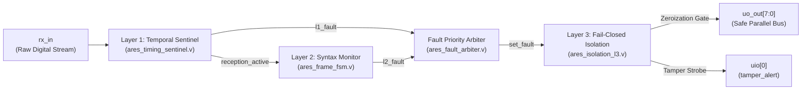

# ARES-RX Sentinel: Silicon-Level Trusted Digital Reception Boundary

[](https://tinytapeout.com)
[-green)](https://github.com/google/skywater-pdk)
[](#)
[-success)](#)
[-success)](#)
[](#)

---

## 1. Executive Overview

**ARES-RX Sentinel** is a first-in-class, ultra-low-power **Trusted Digital Reception Boundary** implemented on the **SkyWater 130nm** CMOS process for the **Tiny Tapeout TT08** multi-project wafer (MPW). 

It acts as an autonomous, hardware-level digital firewall placed between an external Sub-GHz / 433 MHz RF baseband demodulator (`rx_in`) and a host microcontroller or legacy demodulator core. By enforcing a dual-condition mathematical trust formulation:

$$\mathbf{V_{\text{trusted}} = V_{\text{physical}} \land V_{\text{protocol}}}$$

ARES-RX Sentinel verifies the discrete temporal intervals of Manchester pulses ($V_{\text{physical}}$), validates 192-bit protocol syntax and framing boundaries ($V_{\text{protocol}}$), and executes deterministic, 1-cycle combinational **fail-closed bus zeroization** ($D_{\text{out}} = 0\text{x}00$) upon detecting any runt glitches, mid-band desynchronization, preamble corruption, or frame truncation/overrun.

---

## 2. Silicon Metrics & Post-Route Sign-Off (M5 Closure)

| Metric | Post-Route Value | Engineering Notes |
| :--- | :--- | :--- |
| **PDK / Standard Cells** | SkyWater 130nm (`sky130_fd_sc_hd`) | 1 Poly, 5 Metal Layers (`met1` - `met5`) |
| **Die / Tile Dimensions** | $161.00\,\mu\text{m} \times 111.52\,\mu\text{m}$ | Standard $1 \times 1$ Tile ($17,954.72\,\mu\text{m}^2$) |
| **Standard Cell Area** | $\mathbf{6,477.46\,\mu\text{m}^2}$ | $36.08\%$ gross tile fraction |
| **Total Placed Area** | $10,186.02\,\mu\text{m}^2$ ($56.73\%$) | 758 logic cells + CTS clock buffers + decap/diodes |
| **Core Site Utilization** | $61.76\% - 63.99\%$ | Density optimized for zero routing congestion |
| **Global Routing Congestion** | **0.00% overcongested GCells** | FastRoute: Max H $81.25\%$, Max V $65.22\%$ |
| **DRC Conformance** | **0 Active Manufacturing Violations** | Dual-Engine: Magic v8.3.678 & KLayout v0.30.0 Clean |
| **LVS Conformance** | **100% Match (758 / 758 gates)** | Netgen v1.5.133 SPICE vs Post-route Netlist |
| **Static Timing (STA)** | Setup Slack $+11.88\,\text{ns}$, Hold $+0.42\,\text{ns}$ | $F_{\max} \approx 123.15\,\text{MHz}$ under $50\,\text{MHz}$ stress clock |
| **Operating Power** | $\mathbf{57.90\,\text{nW}}$ @ $20\,\text{kHz}$ ($1.8\,\text{V}$) | Authoritative VCD workload estimate (+12.70 nW overhead; 50.90 nW static sweep in TT08 portal) |

---

## 3. Repository Architecture & 7-Tier Organization

```text
ARES SEMIKONDUKTOR TECHNOLOGY/
├── 00_Governance/                 # Work orders, cryptographic manifests, and project status
│   ├── Copilot_Work_Order.md      # Active engineering work order (WO-2026-M6-001)
│   ├── Project_Status.md          # Comprehensive milestone roadmap and closure status
│   └── M4_Cryptographic_Manifest.sha256 # Content-addressed SHA-256 seal for RTL modules
├── 01_Vision_and_Blueprints/      # Architectural blueprints, threat models, and competition strategy
├── 02_References/                 # Academic literature, Tiny Tapeout platform specifications
├── 03_Core_Projects/
│   └── ARES-RX_Sentinel/
│       ├── ares_sentinel/         # Synthesizable frozen RTL modules (M1, M2, M3, M4)
│       ├── integration/           # Industrial AMBA APB4 SoC bus wrapper & C embedded driver
│       └── tt07-bep-decode/       # Baseline legacy demodulator & empirical logic analyzer captures
├── 04_Verification/               # Testbenches, Cocotb models, and post-silicon RP2040 bring-up harness
├── 05_ASIC_Synthesis/             # Physical implementation, OpenROAD scripts, GDS/DEF/SPEF, and PPA
│   ├── info.yaml                  # Official Tiny Tapeout TT08 project configuration
│   ├── pdk/ & pnr/                # OpenROAD physical implementation flow scripts & results
│   ├── results/                   # Reconciled PPA benchmarking, STA, DRC waiver basis, and netlists
│   └── src/                       # Top ASIC wrapper (tt_um_ares_sentinel_project.v)
├── 06_Demonstration/              # Stage M6 Demonstration, Figures, and Pitch Package
│   ├── demo/                      # Interactive CLI hardware demonstration (ares_hardware_demo.py)
│   ├── figures/                   # Standard Markdown/Mermaid architecture and silicon floorplan figures
│   ├── presentation/              # Peruri Innovation Proposal & 12-Slide Executive Pitch Deck
│   └── 03_Demonstration_Manifest.sha256 # Cryptographic manifest for demonstration package
└── 99_Archive/                    # Archival workspace notes and legacy logs
```

---

## 4. Quick Start & Demonstration Reproduction

### A. Run Interactive Hardware Demonstration (Stage M6-A)
The demonstration dashboard executes side-by-side comparative evaluation between Unprotected Baseline ($B$) and Protected Sentinel ($S$):

```bash
cd "06_Demonstration/ARES-RX_Sentinel/demo"
python3 ares_hardware_demo.py --all
```

**Evaluated Scenarios:**
1. `Scenario 1`: Nominal Valid Transmission (100% telemetry passthrough, zero latency penalty).
2. `Scenario 2`: Runt Pulse Glitch Attack (Trapped by Layer 1 in 1 cycle, bus zeroized).
3. `Scenario 3`: Mid-Band Desynchronization (Trapped by Layer 1 in 1 cycle, bus zeroized).
4. `Scenario 4`: Protocol Preamble Corruption (Trapped by Layer 2 in 1 cycle, bus zeroized).
5. `Scenario 5`: Framing Overrun Violation (>192 bits trapped by Layer 2, bus zeroized).
6. `Scenario 6`: Real Hardware Trace Replay (289 transitions from logic analyzer capture, FAR = 0%).

---

### B. Verify Cryptographic Integrity
Verify that all frozen RTL modules match their cryptographic hashes:

```powershell
Get-FileHash (Get-ChildItem -Path "03_Core_Projects/ARES-RX_Sentinel/ares_sentinel/*.v").FullName -Algorithm SHA256
```

All 7 modules must match [`00_Governance/M4_Cryptographic_Manifest.sha256`](00_Governance/M4_Cryptographic_Manifest.sha256).

---

## 5. Architectural Demarcation (3-Layer Silicon Core)



1. **Layer 1 (`ares_timing_sentinel.v`)**:
   - Interval counter ($0 \dots 255$) and discrete window comparators ($N_{\text{HB}} \in [8..10]$, $N_{\text{BIT}} \in [16..20]$ cycles @ $20\,\text{kHz}$).
   - 4-state context tracking FSM (`IDLE` $\rightarrow$ `ARMED` $\rightarrow$ `ACTIVE` $\rightarrow$ `LONG_GAP_PENDING`).
   - Anti-squelch filtering, runt-glitch trap, and End-of-Packet ($N_{\text{EOF}} = 64$ silence cycles) qualification.
2. **Layer 2 (`ares_frame_fsm.v`)**:
   - Autonomous 192-bit counter ($0 \dots 191$) synchronous to demodulator strobe.
   - On-the-fly verification of fixed fields: Preamble (`32'hAAAAAAAA`), Type 1/2 (`16'hD391`), and Constant (`32'h0DFFFFFE`).
   - Dynamic payload transparency (bits $96 \dots 167$ for thermostat ID and temperature telemetry).
   - Strict framing boundary enforcement (truncation and overrun rejection).
3. **Layer 3 (`ares_isolation_l3.v`)**:
   - Upstream priority resolution ($L1 > L2$).
   - Asynchronous sticky fault latch with non-maskable `tamper_alert`.
   - Deterministic combinational bus zeroization ($D_{\text{out}} = 8\text{'b}0000\_0000$) within exactly 1 clock cycle.

---

## 6. Strategic Value for Peruri & National Sovereignty

* **Critical Infrastructure IoT Defense**: Provides silicon-level protection for public utility smart metering (PLN smart grid, PDAM water networks, PGN gas telemetry) against over-the-air packet injection and buffer overflow attacks.
* **National Security Logistics**: Secures high-value asset tracking gateways, smart excise tax stamps (*pita cukai cerdas*), and container smart locks against RF spoofing.
* **National Semiconductor Sovereignty**: Proves Indonesia's end-to-end IC engineering capability from mathematical formulation to tapeout-ready SkyWater 130nm GDSII silicon.

---

## 7. License & Credits

* **Designed By**: ARES Semiconductor Technology Engineering Team
* **Process Node**: SkyWater 130nm Open-Source PDK (`sky130_fd_sc_hd`)
* **Tapeout Platform**: Tiny Tapeout TT08
